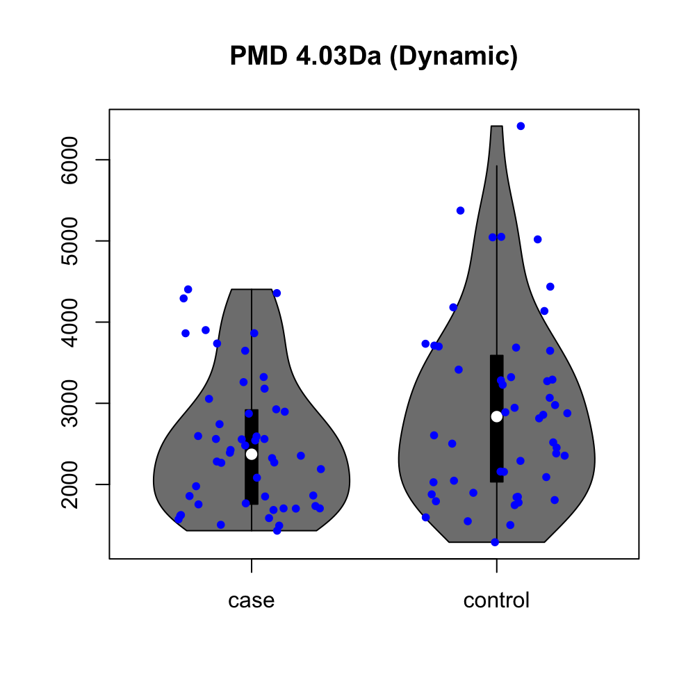

## Disclaimers

-   Some contents are not peer-reviewed

-   No conflict of interest

-   Open to question during presentation

## The molecular bridge

-   How to explain the linkage between exposome and health?

```{mermaid}
flowchart LR
            subgraph Human
                        X(Xenobiotic Compounds) --> W(Metabolites)
                        O(Genome) --> P(Proteome)
                        P --> Q(Metabolome)
            end
            
            A(Environmental Exposures) ==> Human
            Human ==> C(Health)

style Human fill:#fffafa
```

## Questions

Based on data collected from high resolution mass spectrometry:

-   How to assign the sources of molecular in samples?

-   How to build the explainable molecular bridge?

-   How to make quantitative analysis of the molecular bridge?

## Task 1: source appointment of unknown molecular

-   T3DB Endogenous (255) vs Exogenous (705)

{fig-align="center"}

::: footer
Communications Chemistry https://doi.org/10.1038/s42004-020-00403-z
:::

## Task 1: source appointment of unknown molecular

-   Confirmation with known biological reactions

{fig-align="center"}

::: footer
Communications Chemistry https://doi.org/10.1038/s42004-020-00403-z
:::

## Task 1: source appointment of unknown molecular

-   Endogenous compounds: 4.5 (95% CI \[4.3, 4.8\])

-   Exogenous compounds: 1.7 (95% CI \[1.2, 2.2\])

-   Assumptions

    -   Paired mass distances (PMD) contain bio-reaction information

    -   "Foreign" molecular is hard to be attacked by endogenous enzyme

    -   Pay attention to "fake" endogenous compounds

## Task 2: build the explainable molecular bridge

-   PMD can link compounds

-   High resolution mass spectrometry measures peaks

-   Peaks are not equal to compounds

{fig-align="center" width="426"}

## Task 2: build the explainable molecular bridge

-   Algorithm to remove peaks from the same compounds

{fig-align="center"}

::: footer
Analytica Chimica Acta https://doi.org/10.1016/j.aca.2018.10.062
:::

## Task 2: build the explainable molecular bridge

{fig-align="center"}

::: footer
Communications Chemistry https://doi.org/10.1038/s42004-020-00403-z
:::

## Task 3: quantitative analysis of PMDs

-   Measure the changes at reaction level

-   Skip the annotation of unknown compounds

{fig-align="center"}

::: footer
Communications Chemistry https://doi.org/10.1038/s42004-020-00403-z
:::

## Task 3: quantitative analysis of PMDs

-   Qualification of reactions will involved paired ions

    -   Response factors are different

    -   Paired ions have different changing profiles within samples

{fig-align="center"}

## Task 3: quantitative analysis of PMDs

-   Normalization the stable ions and use unstable ions for quantitative analysis

{fig-align="center"}

## Task 3: quantitative analysis of PMDs

-   Double bonds reactions in lung/breast cancer

::: columns
::: {.column width="50%"}

:::

::: {.column width="50%"}

:::
:::

::: footer
Communications Chemistry https://doi.org/10.1038/s42004-020-00403-z
:::

## Take-home message

-   Molecular information will fill the gap between exposures and diseases

-   Network property can be used to distinguish sources of peaks

-   Removal of redundant peaks is crucial for molecular level discussion

-   Quantitation of molecular relations is possible for mass spectrometry

## Acknowledgement

-   Prof. Lauren Petrick's Group \@ Mount Sinai

-   Prof. Janusz Pawliszyn's Group \@ UWaterloo

-   Data Science \@ The Jackson Laboratory

## Q&A

-   miao.yu\@jax.org
