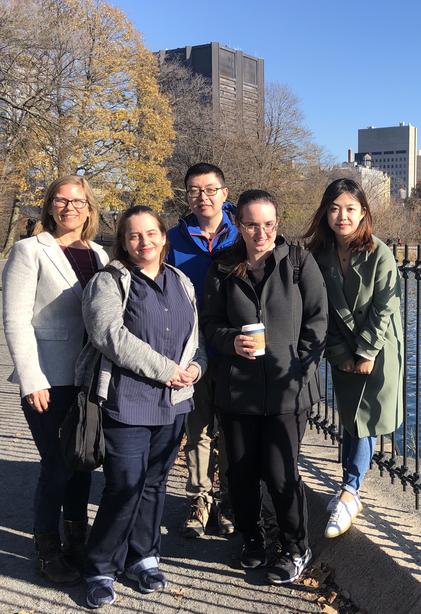

## 环境暴露与健康

```{mermaid}
flowchart LR
            subgraph 生物
                        X(外源污染物) --> W(外源代谢物)
                        O(基因) --> P(蛋白质)
                        P --> Q(内源代谢物)
            end
            
            A(环境暴露) ==> 生物
            生物 ==> C(健康)
            H([生态系统]) --- A
	    F([社会因素]) --- A
            G([个人生活]) --- A
            
            C --- D([疾病])
            C --- E([福利])
	    D --- I[生理疾病]
	    D --- J[心理疾病]
	    E --- K[长寿]
            E --- L[幸福感]
            M[污染物] --- H
            N[气候变化] --- H
            R[教育水平] --- F
            S[收入水平] --- F
            T[烟酒毒品] --- G
            U[饮食习惯] --- G
            V[保健品/健身] --- G

style 生物 fill:#fffafa
```

## 科学问题

- 长岛乳腺癌研究队列

        - 血样：患病组（50） 对照组（50）
        - 人群背景调查：年龄、BMI、收入、教育等
        - 人群营养调查：抽烟、饮酒、饮食习惯、保健品等
        
- 前置研究

        - 健康生活指数（Health Life Index, HLI）与乳腺癌有关 
        
- 研究目标

        - 找到生活方式影响乳腺癌的分子机制

::: footer
- Li, Q. et al. 2022 doi:10.1007/s12282-022-01374-w
:::

## 思路与假设

### 生活方式影响乳腺癌的分子机制

- 影响 ≈ 构建分子与多暴露/乳腺癌的联系（预测性）

        - 疾病与小分子
        - 暴露与小分子

- 分子机制 ≈ 分子间相互作用网络（可解释性）

        - 响应相关
        - 质量差

- 难点

        - 未知物
        - 冗余信息
        - 多暴露

## 思路与假设 - 影响

- 小样本，高维度

- 只保留可能有联系的分子 -> 降维

- 特征工程（L1正则化）

$$生活方式 = f(活性分子)$$
        
$$RSS + \lambda \sum_{j = 1}^{p} |\beta_j|$$

        
## 思路与假设 - 分子机制

> 响应相关但不同的分子会形成网络


::: footer
- Yu, M. et al. 2022 doi:10.1021/envhealth.3c00218
:::

## 思路与假设 - 分子机制

> 相关性阈值 - 包括尽量多的分子，形成尽量多的子网络

:::: {.columns}

::: {.column width="50%"}

:::

::: {.column width="50%"}

:::

::::

::: footer
- Yu, M. et al. 2022 doi:10.1021/acs.est.1c04039
:::

## 思路与假设 - 整合


::: footer
- Yu, M. et al. 2022 doi:10.1021/envhealth.3c00218
:::

## 结果 - 活性分子网络构建

- 代谢组学分析得到 6615 (HILIC) 正离子与 5171 (RP) 负离子

- 去除冗余峰后得到 913 (HILIC) 正离子与 890 (RP) 负离子

- 合并正负离子得到 1790 个独立离子

- 活性分子网络相关性阈值 0.84

- 851个分子属于197个活性分子网络

::: footer
- Yu, M. et al. 2022 doi:10.1186/s13321-022-00586-8
:::

## 结果 - 活性分子网络与暴露/疾病关系

- 乳腺癌与13个小分子有关

- 13个小分子通过活性分子网络拓展到71个小分子

- 71个小分子与5种暴露相关


::: footer
- Yu, M. et al. 2022 doi:10.1021/envhealth.3c00218
:::

## 结果 - 活性分子网络适用性

:::: {.columns}

::: {.column width="50%"}

- 活性分子网络（851）对比全分子网络（1790）

- 71组分子-暴露关系对比300组分子-暴露关系

- 大多数分子-暴露关系 (207/300)是单暴露关系

- 活性分子网络更适合发现“分子看门人”

:::

::: {.column width="50%"}

:::

::::

::: footer
- Yu, M. et al. 2022 doi:10.1021/acs.est.1c04039
:::

## 结果 - 未知物鉴定


::: footer
- Yu, M. et al. 2022 doi:10.1021/envhealth.3c00218
:::

## 结果 - 未知物鉴定

- 母离子：m/z 311.2220 保留时间 6.8 min

- 碎片离子：m/z 293.166, 197.0273, 183.0118

- 数据库匹配（GNPS, MS-DIAL）：13-HPODE

- 标准验证：母离子匹配，保留时间 7.5 min

- 分析 9-HPODE, 12,13-DiHOME, 9,10-DiHOME 碎片离子

- 12,13-DiHOME 9,10-DiHOME 保留时间接近，推测含有两个羟基

- 碎片离子含有9个碳

- 推测为 dihydroxyoctadeca dienoate (DiHODE)

::: footer
- Yu, M. et al. 2022 doi:10.1021/envhealth.3c00218
:::

## 结果 - 未知物鉴定

- DiHODE 与β胡萝卜素、叶酸、饮酒和肉类摄入有关系

- DiHODE 属于环氧脂肪酸降解产物

- 环氧水解酶（epoxide hydrolases）可能跟炎症有关 

- β胡萝卜素补充可提高DiHODE脱水产物进而提高DiHODE

- 提高的DiHODE与癌症发病率负相关

- 生活方式引发的炎症可能与乳腺癌有关联

## 展望

- 发现与解释响应多暴露的代谢网络及酶

- 分子可拓展到大分子并考虑大小分子间的互相作用

- 特征工程可以用来构建暴露/疾病与分子关系

- 质量差可以协助解释基于相关性构建的活性分子网络

## 局限性

- 样品量小、采集时间长

- 探索性研究非验证性研究

- 未知物半定性

- 活性分子网络构建过程没考虑质量差

## 可重复性

- 数据涉及隐私目前不公开

- 数据处理代码在论文支持信息里

- enet包 <https://github.com/yufree/enet>

## 结语

- 数据中分子间相互关系可用来解释暴露导致疾病的分子机制

- 活性分子网络本质就是通过分子间相互关系降维

- 小样本上机器学习更适用于降维

- 存在未知物不代表无法讨论

{.r-stretch}

## 致谢

:::: {.columns}

::: {.column width="50%"}

- Dr. Petrick's research group

- Dr. Qian Li

- Prof. Jia Chen

- Prof. Mary Wolff

- Prof. Susan Teitelbaum

- The Senator Frank R. Lautenberg Environmental Health Sciences Laboratory

:::


::: {.column width="50%"}


:::

::::

# 欢迎各位老师批评指正!

::: footer
miao.yu@jax.org
:::
