## GC-MS

<div class="columns-2">

- 环境分析中最常用仪器之一
- 选择离子模式定量
- 定性离子与全扫描定性
- 谱图比对对前处理要求高

<center>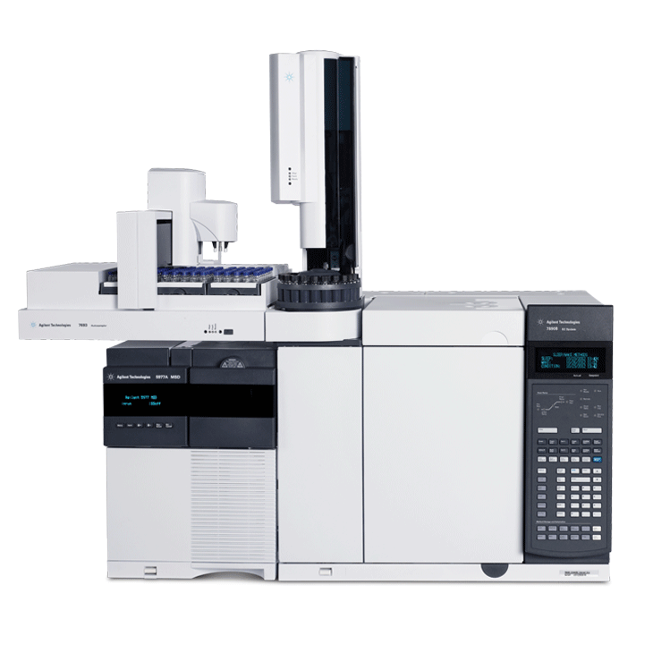</center>
</div>
## 基质效应

- 环境分析的核心之一
- 按介质分类，无法排除同一环境介质的异质性
- 分析方法建立多依赖标准，无法排除假阳性问题
- 前处理的净化一般是针对性的

**环境样品中持久性物质在GC-MS分析里基质效应究竟是什么? 如何描述？如何去除？**

## 前处理方法

<div class="columns-2">

- 化学性质相对稳定
    - 有机溶剂萃取
    - 强氧化还原条件不破坏结构
    - 44%酸性硅胶
    - 极性物质去除
    - 弗罗里硅土 中性氧化铝 中性硅胶
    - ASE一步法

<center>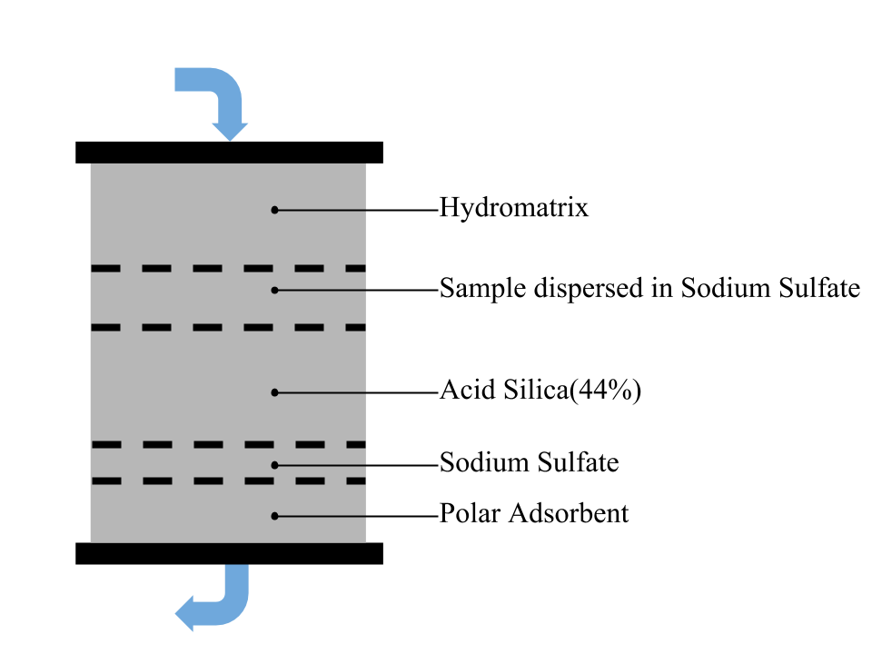</center>
</div>
## 实验平台

- 仪器：Agilent 6890 GC coupled with 5973C MS detector 
- 色谱柱：DB-5ms 15 m × 0.25 mm × 0.1 μm
- 进样口温度：300ºC
- 恒流模式载气（He）流速：1mL/min
- 升温条件：
    - 初始温度：100ºC（3min）
    - 升温段：100ºC-320ºC（10ºC/min）
    - 后运行：320ºC（3min）
- 质谱溶剂延迟：3min
- 全扫描参数：m/z 100-500，m/z 500-1000

## 数据分析环境

- R version 3.2.2 (2015-08-14)
- Platform: x86_64-apple-darwin13.4.0 (64-bit)
- Running under: OS X 10.11 (El Capitan)
- R package: mzR_2.2.1

## 基质效应是什么？溶剂
<div class="columns-2">

    - 数据分布
<center>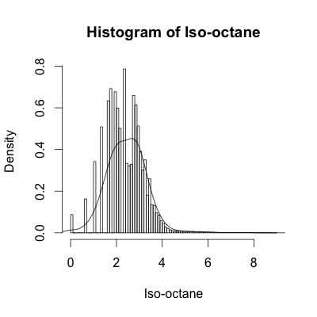</center>


    - 可视化
<center>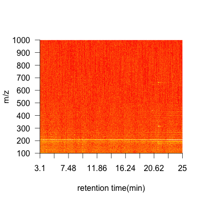</center>
</div>

## 基质效应是什么？标准
<div class="columns-2">

    - 数据分布
<center>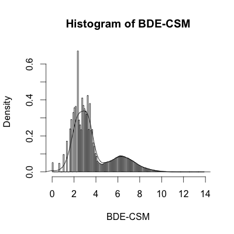</center>


    - 可视化
<center>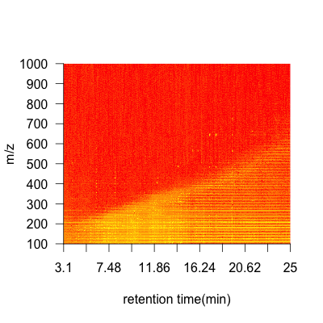</center>
</div>

## 基质效应是什么？前处理过程
<div class="columns-2">

    - 数据分布
<center>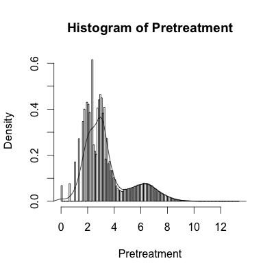</center>


    - 可视化
<center>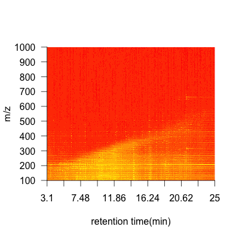</center>
</div>

## 基质效应是什么？标准参考物质
<div class="columns-2">

    - 数据分布
<center>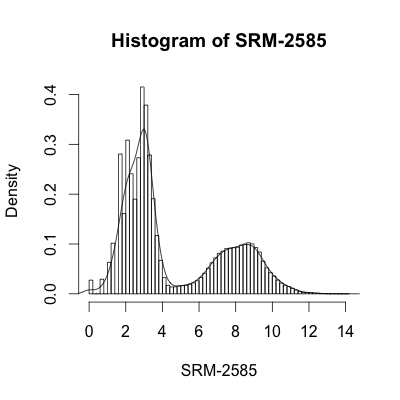</center>


    - 可视化
<center>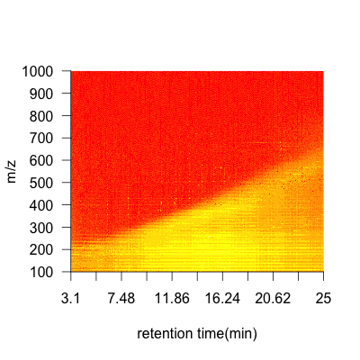</center>
</div>

## 基质效应的描述
<div class="columns-2">
    - 边界点响应变化大
    - 质量数尺度的一阶导数
    - 响应阈值对数尺度大于5
    - 线性回归得到基质效应曲线
    - 基质效应随温度变化，可以预估
    - 峰前后背景扣除只适用于等温过程

<center>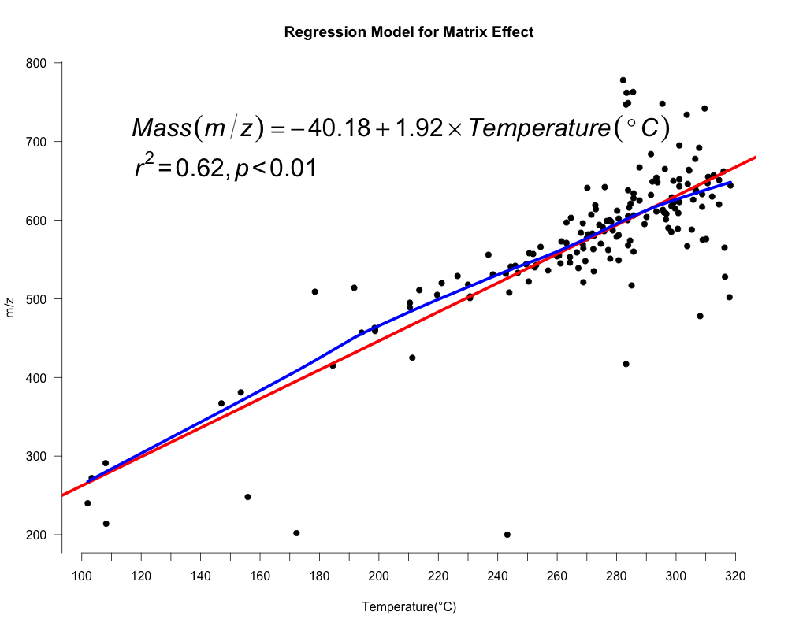</center>
</div>

## 基质效应的去除

<div class="columns-2">
<center></center>
        
<center></center>

</div>

## 基质效应的去除

<center>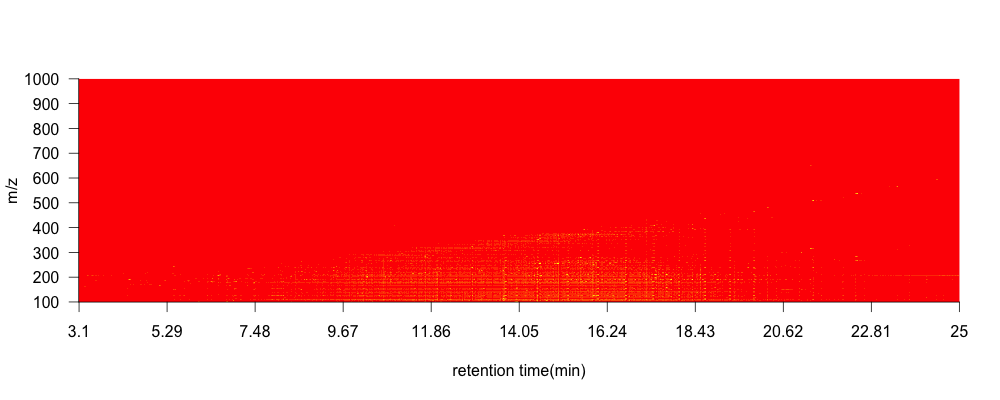</center>

$$Intensity = exp(logH - max(logH)) - exp(1ogL - max(logL))$$

## 小结

- 图是发现问题的第一步
- GC-MS中的基质效应广泛存在的
- 基质效应可用温度与质量数来定量描述
- 基质效应可通过数据处理去除
- 基质效应可以进行模式识别

## THANK YOU

<br>
<br>
<br>
<br>
<br>
<center><font size="15">欢迎各位老师同学批评指正!</font></center>
```{r echo=FALSE,eval=FALSE}
source('./code/code.R')
xsetraw <- xcmsRaw(cdffiles3[3])
xsetraw2 <- xcmsRaw(cdffiles3[8])
data1 <- conbinemd(xsetraw,xsetraw2)
plotms(data1)

hist(log(data1+1),breaks = 100,freq = F,xlab = 'Iso-octane',main = 'Histogram of Iso-octane')
lines(density(log(data1+1),bw=0.3))

xsetraw <- xcmsRaw(cdffiles12[3])
xsetraw2 <- xcmsRaw(cdffiles12[8])
data1 <- conbinemd(xsetraw,xsetraw2)
plotms(data1)
hist(log(data1+1),breaks = 100,freq = F,xlab = 'BDE-CSM',main = 'Histogram of BDE-CSM')
lines(density(log(data1+1),bw=0.3))

cdffiles9 <- list.files('./Hybird/', recursive = TRUE, full.names = TRUE)
xsetraw <- xcmsRaw(cdffiles9[2])
xsetraw2 <- xcmsRaw(cdffiles9[7])
data1 <- conbinemd(xsetraw,xsetraw2)
plotms(data1)
hist(log(data1+1),breaks = 100,freq = F,xlab = 'Pretreatment',main = 'Histogram of Pretreatment')
lines(density(log(data1+1),bw=0.3))

cdffiles14 <- list.files('./2585/', recursive = TRUE, full.names = TRUE)
xsetraw <- xcmsRaw(cdffiles14[2])
xsetraw2 <- xcmsRaw(cdffiles14[9])
data1 <- conbinemd(xsetraw,xsetraw2)
hist(log(data1+1),breaks = 100,freq = F,xlab = 'SRM-2585',main = 'Histogram of SRM-2585')
lines(density(log(data1+1),bw=0.3))
plotms(data1)
findline(data1)

xsetraw <- xcmsRaw(cdffiles14[11])
xsetraw2 <- xcmsRaw(cdffiles14[12])
xsetraw3 <- xcmsRaw(cdffiles14[13])
xsetraw4 <- xcmsRaw(cdffiles14[14])
data1 <- conbinemd(xsetraw,xsetraw2)
data2 <- conbinemd(xsetraw3,xsetraw4)


                               
cdffiles15 <- list.files('./258535/', recursive = TRUE, full.names = TRUE)
xsetraw <- xcmsRaw(cdffiles15[11])
xsetraw2 <- xcmsRaw(cdffiles15[12])
data30 <- conbinemd(xsetraw,xsetraw2)

r <- log(data1)-log(data30)
d <- exp(log(data1)-max(log(data1)))-exp(log(data30)-max(log(data30)))
d[d<0|log(d)< -10] <- 0

plotms(10*d)
```