## Introduction

-   Overview of Ion Mobility Spectrometry (IMS)
-   Overview of Mass Spectrometry (MS)
-   Overview of Mass Spectrometry Imaging (MSI)
-   Importance of timsTOF MSI in analyzing complex biological samples
-   Current limitations

## Overview of Ion Mobility Spectrometry (IMS)

-   **Ion Mobility Spectrometry (IMS)** is a technique used to separate ions based on their shape, size, and charge.

-   Provides detailed information about the physical and structural properties of ions.

    

## What is Mass Spectrometry?

-   **Mass Spectrometry (MS)** is an analytical technique used to measure the mass-to-charge ratio of ions.
-   It provides information about the molecular weight and structure of compounds.
-   Commonly used in chemistry, biology, and environmental science for:
    -   Characterizing molecules
    -   Determining molecular weights
    -   Analyzing complex mixtures

## The Components of Mass Spectrometry

-   **Ionization Source**: Converts sample molecules into ions.
-   **Mass Analyzer**: Separates ions according to their mass-to-charge ratio.
-   **Detector**: Captures the separated ions and generates a signal proportional to their abundance.
-   **Data Analysis Software**: Processes and interprets the detected signals to provide quantitative and qualitative information.

## What is TIMS-TOF?

-   **Ionization**: Sample ions are generated using methods like MALDI (Matrix-Assisted Laser Desorption/Ionization).
-   **Ion Mobility Separation**:
    -   Ions are introduced into the TIMS device where they experience a travelling wave field.
    -   Size and shape of ions affect their mobility through the gas, separating them based on their drift times.
-   **Time-of-Flight Analysis**:
    -   After mobility separation, ions are accelerated into a vacuum, and their time to reach the detector is measured.

## What is Mass Spectrometry Imaging (MSI)?

-   **Mass Spectrometry Imaging (MSI)** combines mass spectrometry with imaging techniques.
-   It allows for spatial localization of chemical information within a sample.
-   Useful in:
    -   Analyzing tissue samples in medical research
    -   Mapping the distribution of metabolites or drugs in biological samples

## What is Mass Spectrometry Imaging (MSI)?

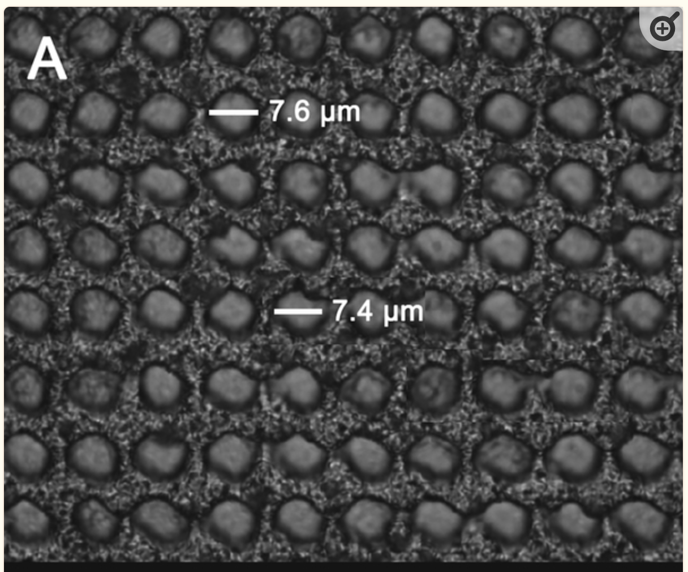{fig-align="center"}

## What is TIMS-TOF-MSI？

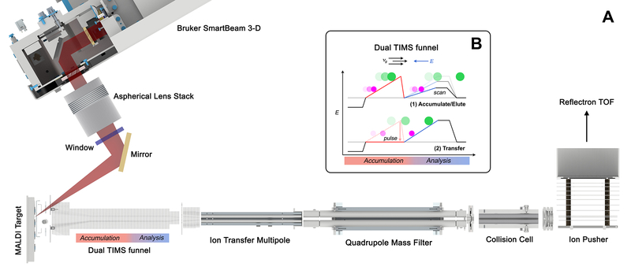{fig-align="center"}

## Advantages of timsTOF MSI

-   **High Sensitivity and Resolution**:
    -   High spatial and mass resolution allows for detailed imaging of complex biological samples.
-   **Structural Insights**:
    -   The combination of ion mobility and mass analysis provides information on ion conformation and interactions.
-   **Rich Chemical Information**:
    -   Enables comprehensive profiling of lipids, metabolites, and proteins within tissues.

## Current Limitations

-   Data size (30-100GB per slides)

-   Throughput is limited by workstation based software

-   Open source format doesn't support ion mobility MSI data

-   Lack of biological interpretation

## Workflow Overview

-   The workflow involves several steps:
    1.  **Data Acquisition**: Collecting mass spectral data from samples.
    2.  **Data Processing**: Normalizing and analyzing the acquired data.
    3.  **Data Interpretation**: Drawing conclusions from the results and creating visual representations of the data.

## Workflow Overview

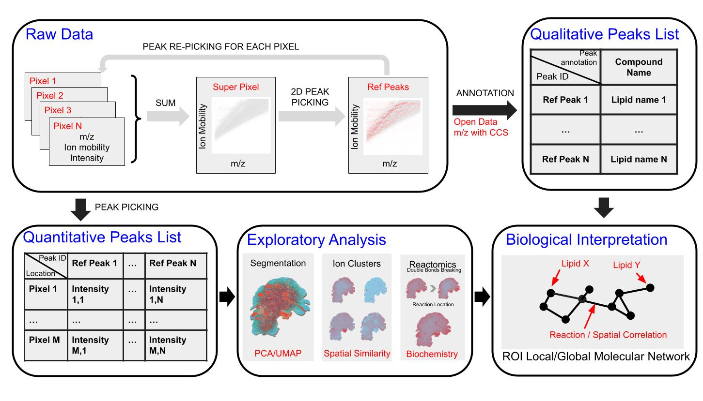{fig-align="center"}

## Raw Data Processing

### Reference Peaks Extraction

-   Combine peaks from all pixels into super pixels for reference peak picking.
-   Load raw MSI data and extract frame information.
-   Process data in batches to manage memory usage.
-   Save reference peaks for later analyses.

## Reference Peak Picking

### Peak Picking Function

-   Define functions using Rcpp for efficient peak picking in 2D space.
-   Parameters include:
    -   mz_ppm: ppm tolerance for m/z values
    -   ccs_tolerance: tolerance for collision cross-section values
    -   snr: signal-to-noise ratio
-   Perform the peak picking on super pixels and filter peaks based on intensity thresholds.

## Reference Peak Picking

::::: columns
::: {.column width="60%"}
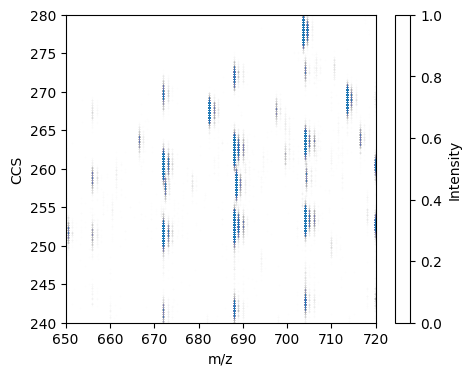{fig-align="center"}
:::

::: {.column width="37%"}
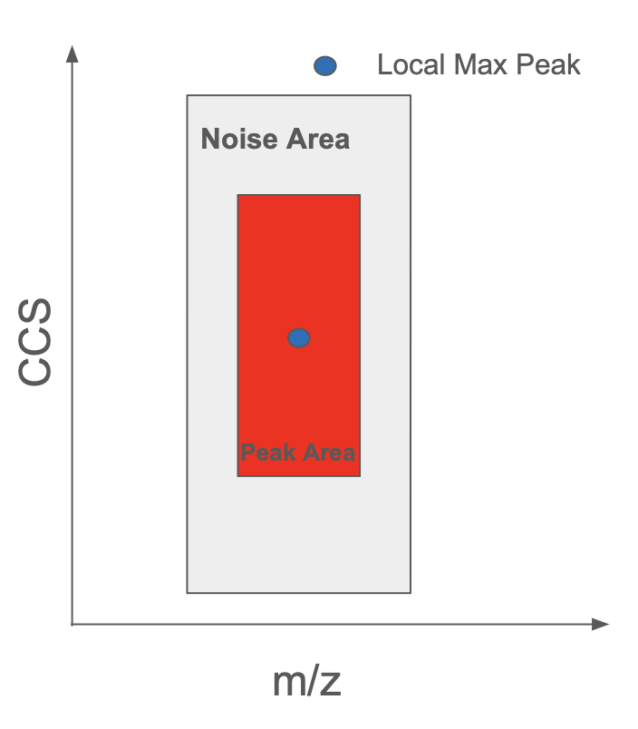{fig-align="center"}
:::
:::::

## **Quantitative & Qualitative Peaks List**

### **Quantitative Analysis**

-   Extract peak intensities across all pixels based on reference peaks.

-   Normalize intensities using TIC (Total Ion Count) for better comparisons.

## **Quantitative & Qualitative Peaks List**

### **Qualitative Analysis**

::::: columns
::: {.column width="50%"}
-   Annotation of peaks against existing databases for lipids and metabolites.

-   Matches based on m/z and CCS values for biological relevance.

-   rmwf::runmzccsanno()
:::

::: {.column width="50%"}
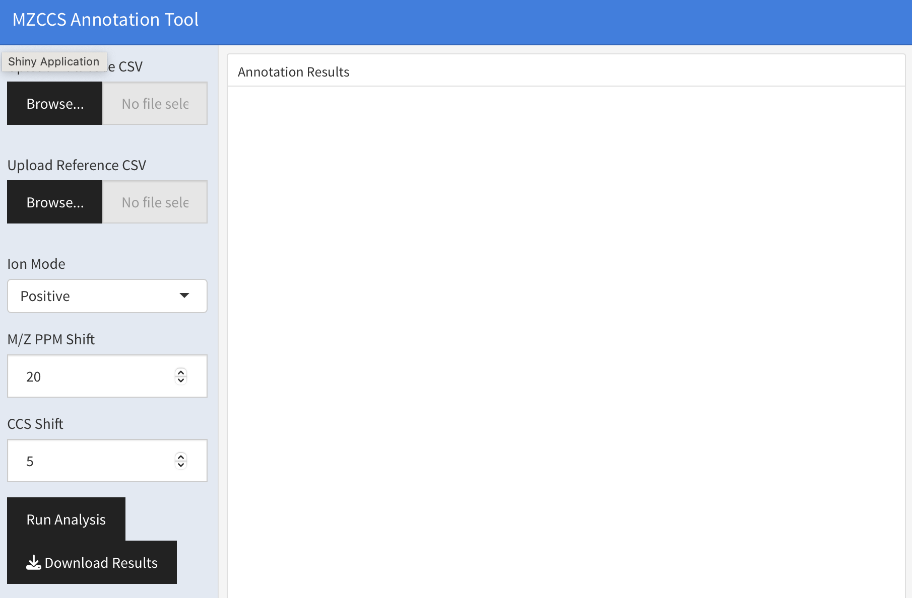{fig-align="center"}
:::
:::::

## **Exploratory Analysis**

### **Peak Statistics**

-   Visualize peak number distributions across pixels using histograms and scatter plots.

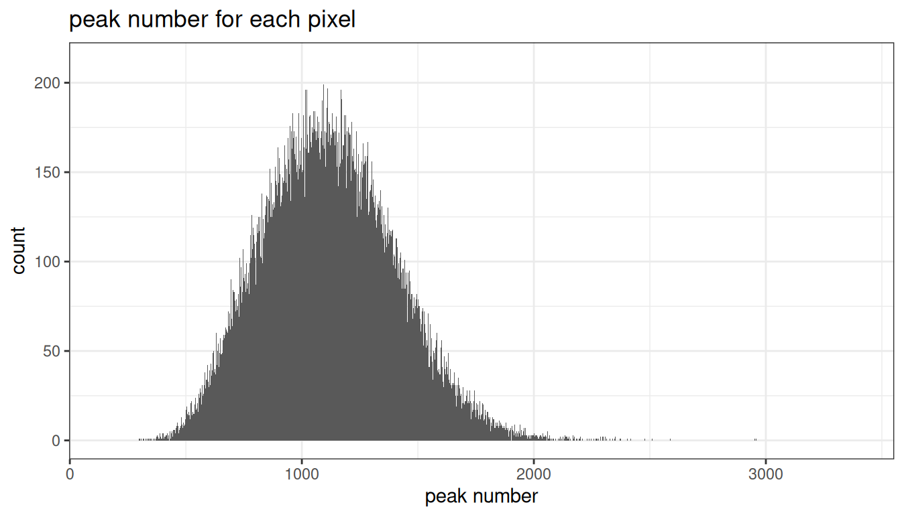{fig-align="center"}

## **Exploratory Analysis**

### **Visualization of Selected Ions**

::::: columns
::: {.column width="30%"}
-   Save and visualize ion images for specific selected ion.
:::

::: {.column width="70%"}
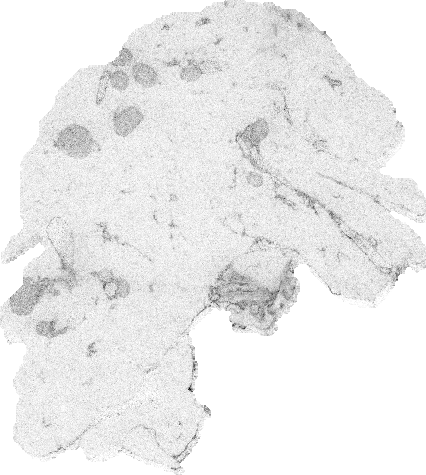{fig-align="center"}
:::
:::::

## **Segmentation**

### **PCA and UMAP Segmentation**

-   Use PCA and UMAP for data dimensionality reduction.

-   Perform clustering to identify regions of interest in MSI data.

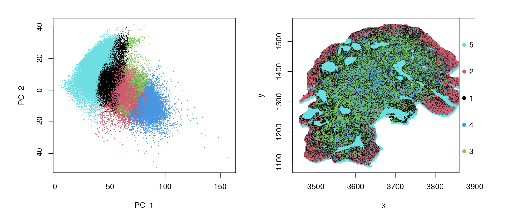{fig-align="center"}

## **Ion Clustering**

::::: columns
::: {.column width="50%"}
-   Cluster ions based on spatial distribution similarities.

-   Generate spatial maps for ion clusters to visualize their distribution.

-   Ions cluster can be used to identify ROI specific compounds
:::

::: {.column width="50%"}
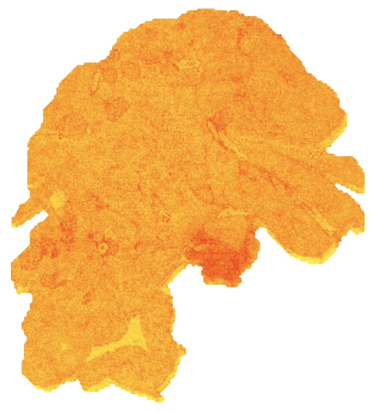{fig-align="center"}
:::
:::::

## **Reactomics Analysis**

-   Reactomics refers to evaluate reaction relation among compounds.

-   Paired Mass Distances (PMDs) is calculated for reaction level assessments.

-   Linear regression analyzes changes in response to factors.

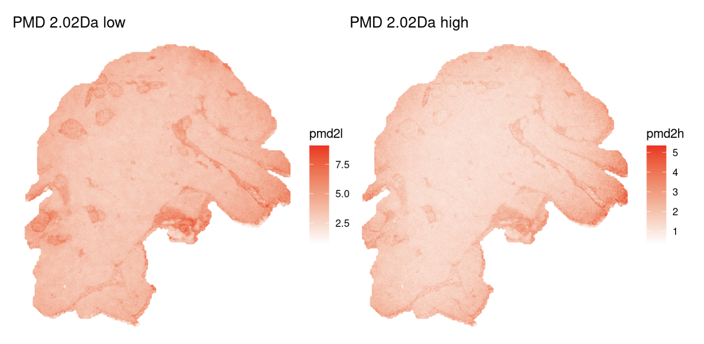{fig-align="center"}

## **Molecular Network Analysis**

### **Building and Visualizing Networks**

-   Create molecular networks from annotated ion data.

    -   Nodes as compounds
    -   Edges as spatial/chemical relation

-   Visualize networks to illustrate relationships among chemical species.

-   [Shiny application online](https://thejacksonlaboratory.shinyapps.io/msinet/) rmwf::runmsinet()

## **Conclusion**

-   timsTOF MSI is useful to access spatial/chemical changes within biological samples.

-   OSSpRe is developed to analysis timsTOF MSI data.

-   Can be coupled with other omics/imaging technique.
