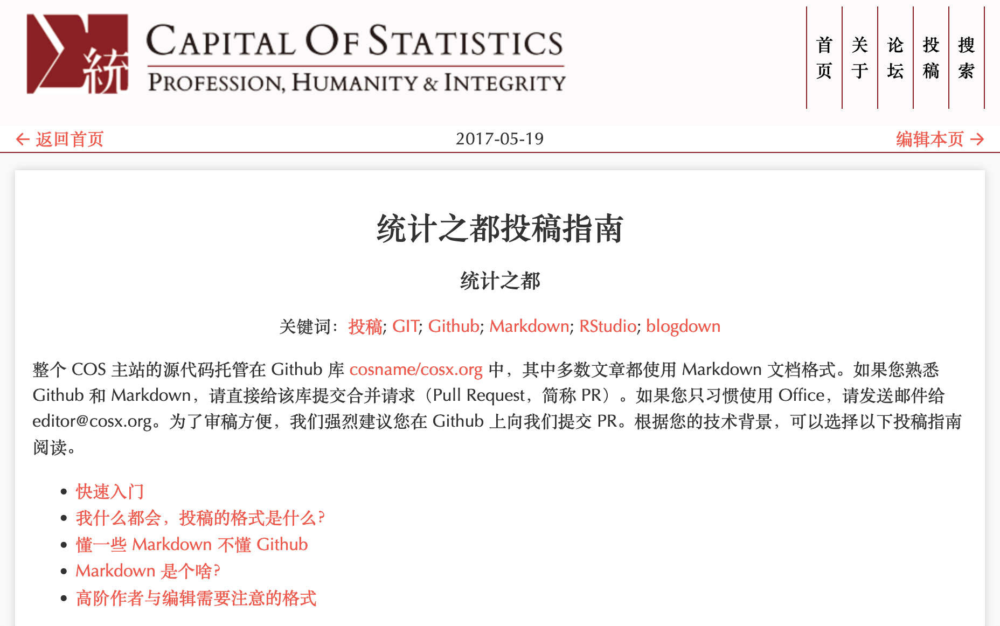
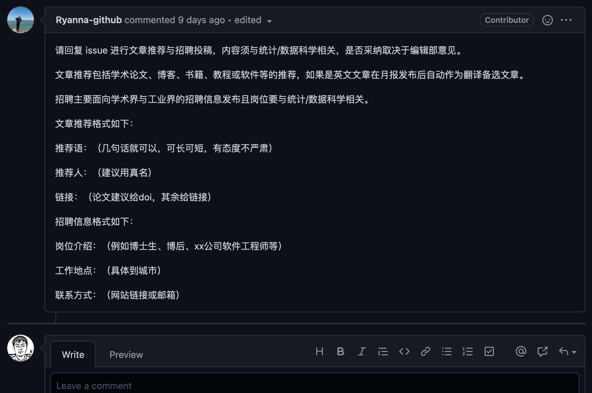
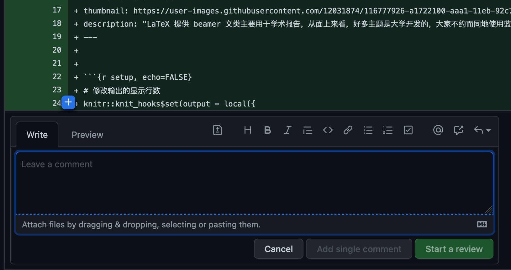

```{r setup, include=FALSE}
options(htmltools.dir.version = FALSE)
knitr::opts_chunk$set(fig.align='center',echo = F, cache=T,message=FALSE,warning=FALSE,comment=NA)
```

## 统计之都编辑部

### 下属项目

- Costudy：服务学生和从业者。邀请嘉宾线上直播，聚焦核心关切话题，传道授业解惑
- 人物访谈：介绍相关学者、业界人才的成长经历，以传授知识、 激励后学、传承精神 
- 文献编译：关注经典学术文献、翻译前沿综述，填补学术前沿与经典教材间的空白
- 软件工具：系统介绍统计学与数据科学相关的软件工具或工作流
- 产业实践：聚焦业界需求，分享实战经验与案例
- 焦点讨论：紧追时事热点，采集统计与数据相关专家观点，提供多维视角
- 统计月读：最新文章推荐与招聘信息，内容须与统计/数据科学相关
- 数据科学之路：系统全面梳理、撰写数据科学思想、理论、技术、实践等知识体系，供大众学习和讨论
- 执行编辑与技术支持：负责公众号、主页、微博、B站文章视频的编辑和发布，提供技术支持

### 联系方式：editor@cosx.org

---

## 如果你想参与……

### 邮箱联系 editor@cosx.org

### 统计月读 GitHub 端在线投稿

### 主站 GitHub 端 PR 投稿

---

## 主站投稿系统

### 注册一个 GitHub 账号

### 阅读[投稿指南](https://cosx.org/contribute/)

### 技术类文章请使用 PR 投稿

### 轻量级观点吐槽可投稿月读

---

## 创建 GitHub [账号](https://github.com/)

### 猛击注册

```{r echo=FALSE,out.width='70%'}
knitr::include_graphics('https://raw.githubusercontent.com/yufree/yufree.cn/master/static/images/githubreg.png')
```

---

## 创建 GitHub 账号

### 完成注册

```{r echo=FALSE,out.width='70%'}

```

---

## [投稿指南](https://cosx.org/contribute/)

```{r echo=FALSE,out.width='70%'}

```

---

## 月读投稿[演示](https://github.com/cosname/cosx.org/issues/980)

```{r echo=FALSE,out.width='70%'}

```

---

## 稿件收到后……

### 分配稿件给具体编委

### 编委按各自项目要求给出意见

### 编辑回信告知接收状况与初步处理意见

- 主站稿件原则上要走审稿流程，三个月内处理完成
- 微信稿件参考编委意见进行转载、月读或微博推荐

### 稿件发布后编辑通知作者并给出链接

---

## 开放式审稿[演示](https://github.com/cosname/cosx.org/pull/978/files)

```{r echo=FALSE,out.width='90%'}

```

---

class: inverse, center, middle

## 欢迎投稿！

## editor@cosx.org
