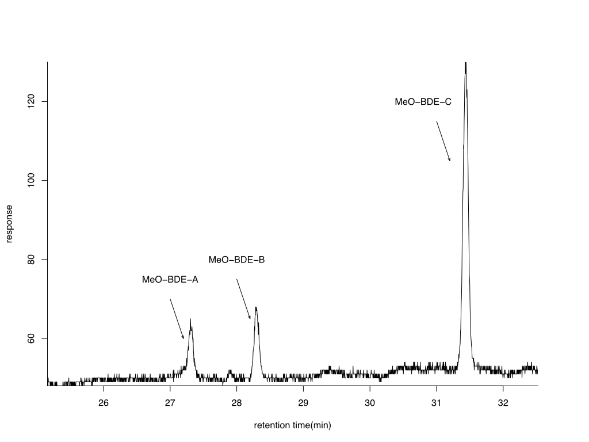
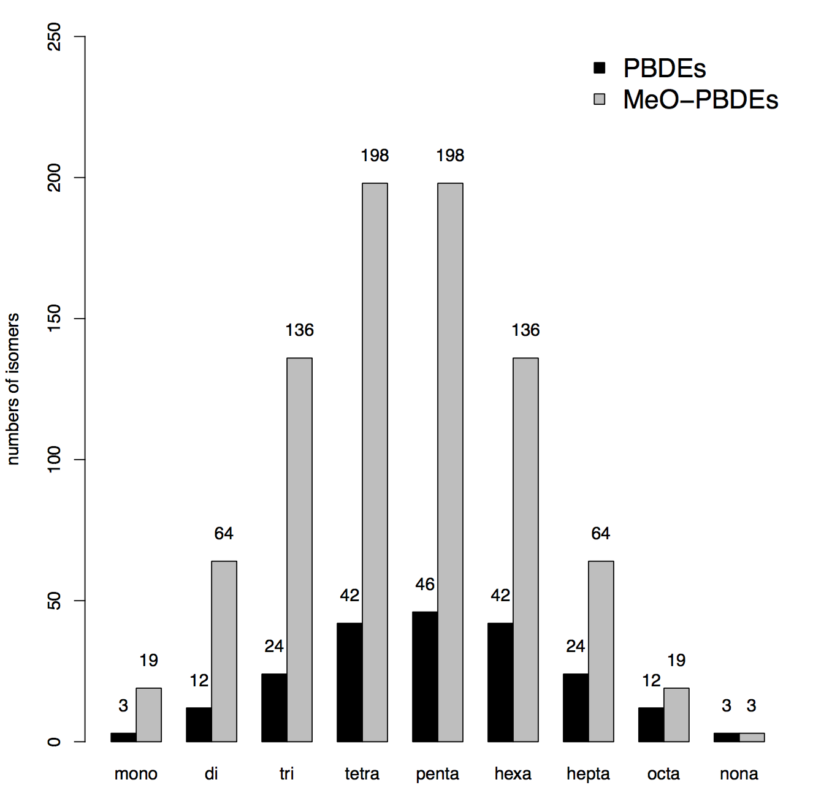
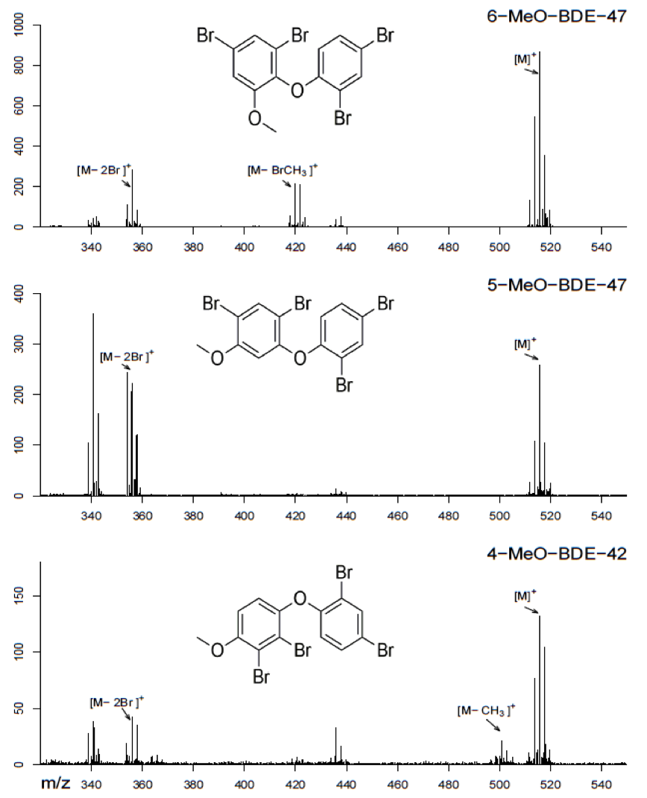
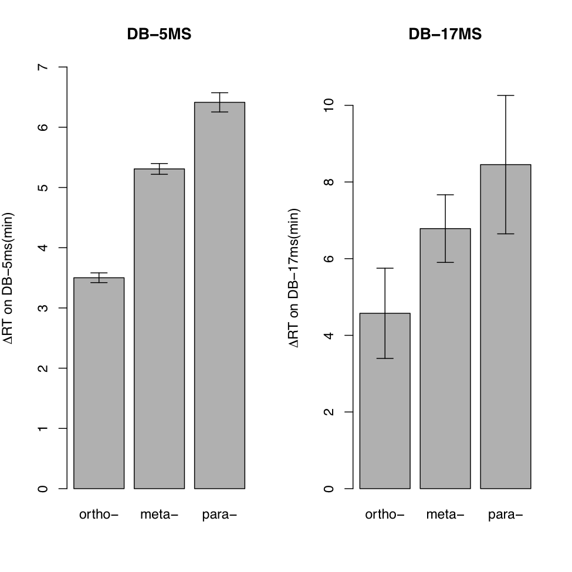
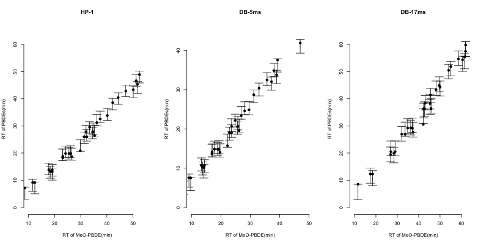
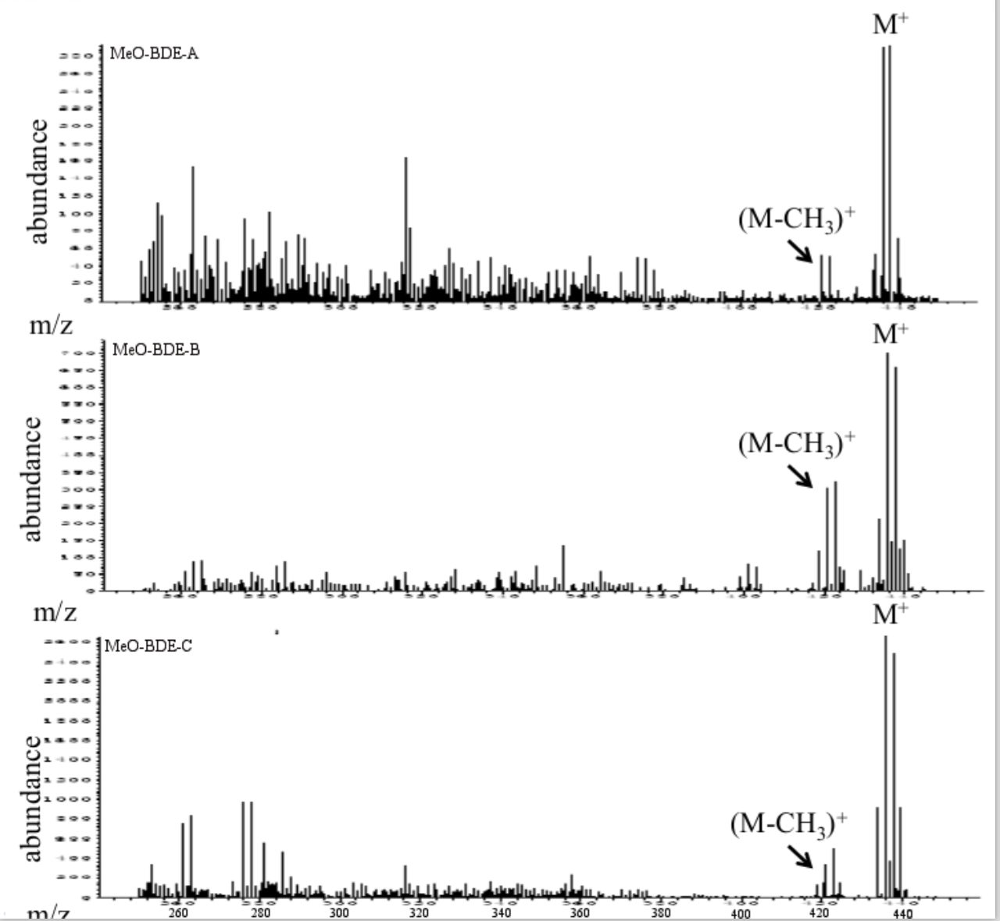
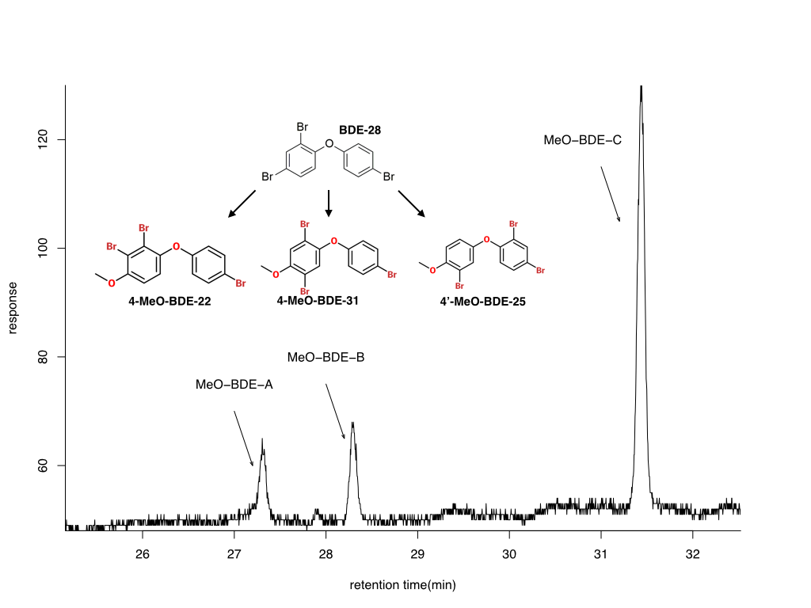
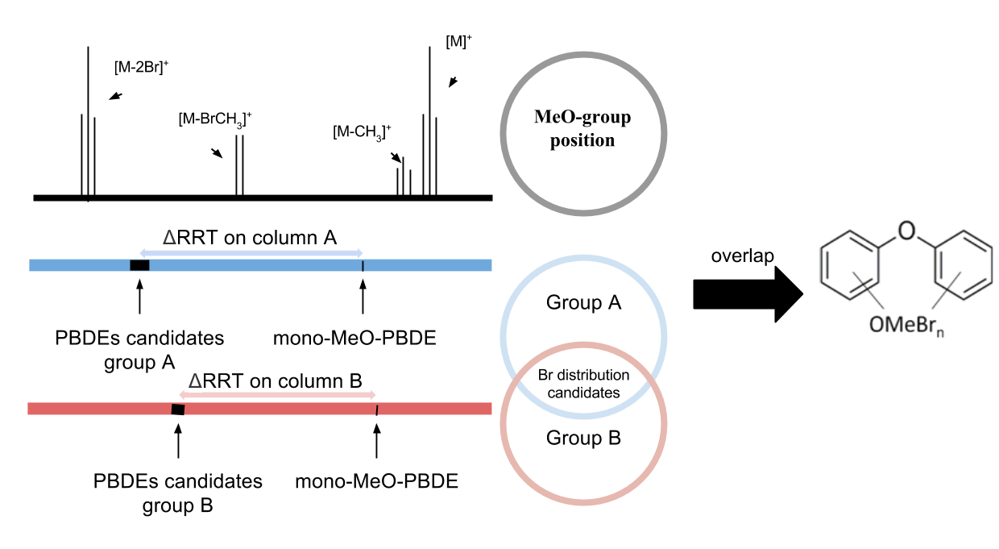

## 研究背景

- MeO-PBDEs在环境样品中广泛检出
    
    - 生物样品
    - 非生物样品
    
- 结构类似物的危害

    - 多溴联苯醚被斯德哥尔摩公约禁止使用
    - 羟基取代多溴联苯醚具有神经毒性

## 研究背景

- 天然来源：science报道
- PBDEs及其结构类似物的生物转化

## 研究现状

- MeO-PBDEs

    - 已有标准相对总数太少
    - 如何利用质谱信息

- PBDEs的无标准定性
  
    - 计算分子描述符
    - 构建分子描述符与色谱保留时间关系
    - 根据未知物保留时间预测溴原子排布

## 研究思路

- 现有标准的质谱信息
- 现有标准的色谱信息
- 构建模型进行结构推测

## MeO-PBDEs质谱行为规律

## MeO-PBDEs色谱行为规律

## 统计建模

$$RT_{BDE-n} = \beta_0 RT_{MeO-BDE-n} + \beta_1 D_{ortho} + \beta_2 D_{meta} + \beta_3 D_{para}$$

        MeO-PBDEs   邻位      间位      对位
-----  -----------  --------  --------  --------
DB-1    0.9754      -3.1631   -4.9484   -6.3232
DB-5    0.9732      -2.0507   -3.5075   -4.6575
DB-17   1.047       -6.504    -8.582    -10.516

## 拟合效果

## BDE-28南瓜活体暴露未知代谢产物定性

## BDE-28南瓜活体暴露未知代谢产物定性

## BDE-28南瓜活体暴露未知代谢产物定性

- 对应PBDEs出峰顺序：BDE-25 < BDE-31 < BDE-22
- MeO-tri-BDE-A 为 4’-MeO-BDE-25
- MeO-tri-BDE-B 为 4-MeO-BDE-31 
- MeO-tri-BDE-C 为 4-MeO-BDE-22 

## 小结

## THANK YOU

 
 
 
 
 

欢迎各位老师同学批评指正!
