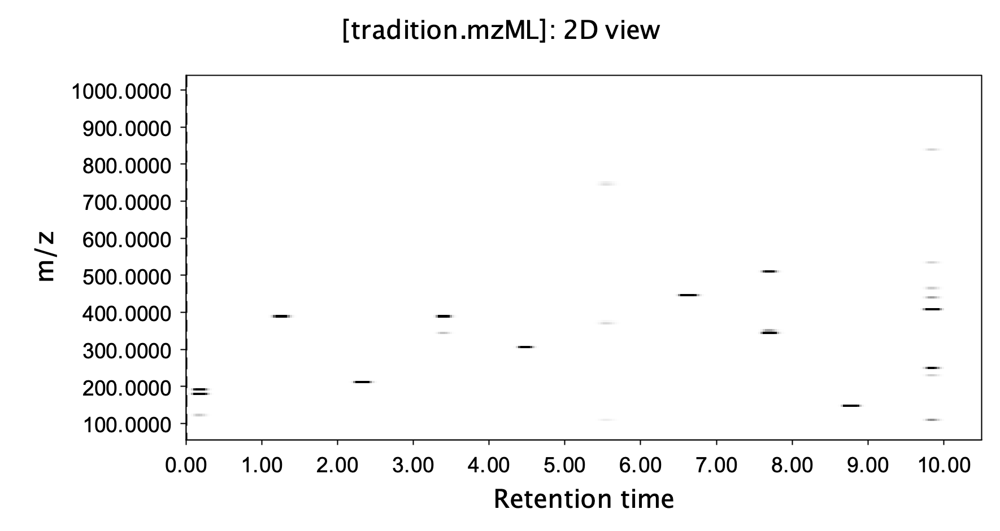
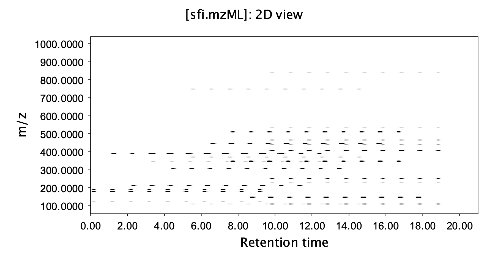
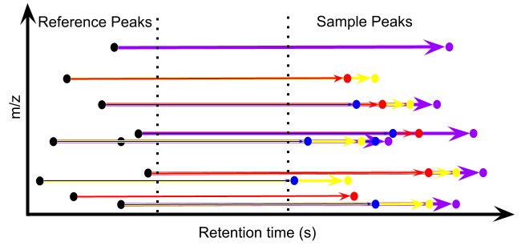
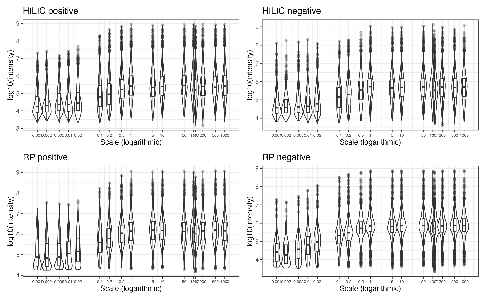

## 常规 LC-MS 分析的挑战

-   顺序进样通量不足

        - 单仪器年产出数千样品数据
        - 落后基因组学一个数量级

-   批次效应（batch effects）

-   保留时间漂移（retention time shifts）

## 现有应对策略

-   双柱切换系统

        -  两根色谱柱交替使用

-   表面多孔填料色谱柱

        - 高流速下仍有良好分离度
        
-   靶向质谱分析 MISER 或 SQUID 策略

        - 固定时间间隔多重进样时间

## 单文件进样法

-   使用连续的等度洗脱进行色谱分离

        -   每个样本的边际时间成本仅相当于固定的进样间隔时间

-   固定时间间隔的多重进样推广到非靶向分析

        -   所有样本的数据将生成在一个单独的文件中

-   不进行仪器物理改造的情况下实现多样本的并行数据采集

-   提供数据分析支持软件

## 序列设计

### 参考峰采集

-   进行多个**混合样本**（Pooled Samples）和**空白样本**（Blank Samples）的完全分离
        
        - 覆盖尽可能多的化合物
        
        - 排除掉背景干扰
        

## 序列设计
    
### 真实样本采集

- 在连续的等度洗脱条件下，以固定的时间间隔进不同样品

        - 可插入混合样或空白样品进行质控
        

        
## 数据分析与峰恢复

- 开源 R 软件包 `sfi` （https://github.com/yufree/sfi）

### 核心算法

## 初步验证

### 实验样本

-       158 个人血浆样本 

-       模拟了横跨7个数量级的宽动态范围

-       HILIC（亲水作用色谱）和 RP（反相色谱）柱

-       正离子和负离子双模式

## 初步验证

### 定性定量结果

-       包括质量控制样本在内，158 个样本的总分析时间 < 6 小时

-       HILIC 正/负模式下，从 158 个样本中分别恢复了 2,852,581 / 2,613,583 个与参考峰匹配的峰
        
        - 在 HILIC 柱上，506/572 个参考峰（正/负模式）的相对标准偏差（RSD）低于 30%

-       RP 正/负模式下，分别匹配了 2,545,314 / 2,141,019 个峰

        - 在 RP 柱上，450/738 个参考峰（正/负模式）的 RSD 低于 30%

## 初步验证

### 定量动态范围

## 局限性

### 同分异构体

-       具有相同质荷比（m/z）但保留时间不同的异构体受影响最大

-       由于峰恢复算法只检查保留时间漂移在 10 秒内的异构体，异构体的影响在单文件模式下有限

-       在 HILIC 正/负模式下，约有 3649/3562 个峰存在异构体问题（影响不到 2% 的对齐参考峰）；RP 柱表现更好，只有 474/68 个异构体峰

### 分离效能

-      由于使用等度洗脱，SFI 方法的分离效能低于传统的梯度洗脱方法

## 应用展望

-  适用于有超大规模样本分析与数据库构建的项目

-  可结合活体采样技术检测动态环境过程

-  单样品成本低于10美元，可进行临床分析靶向/非靶向检测

