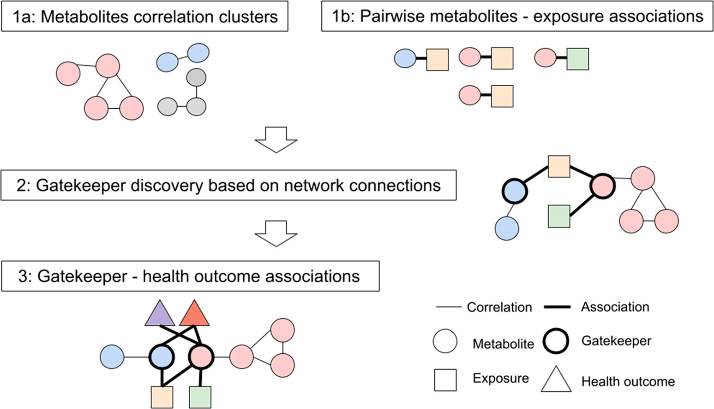
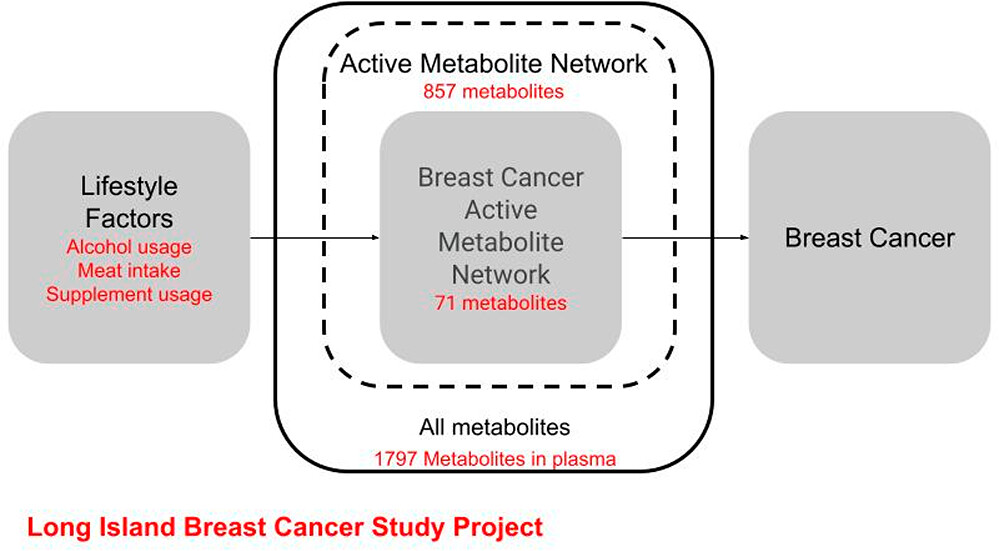
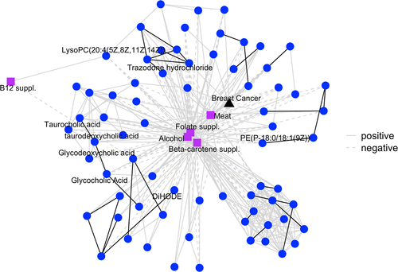
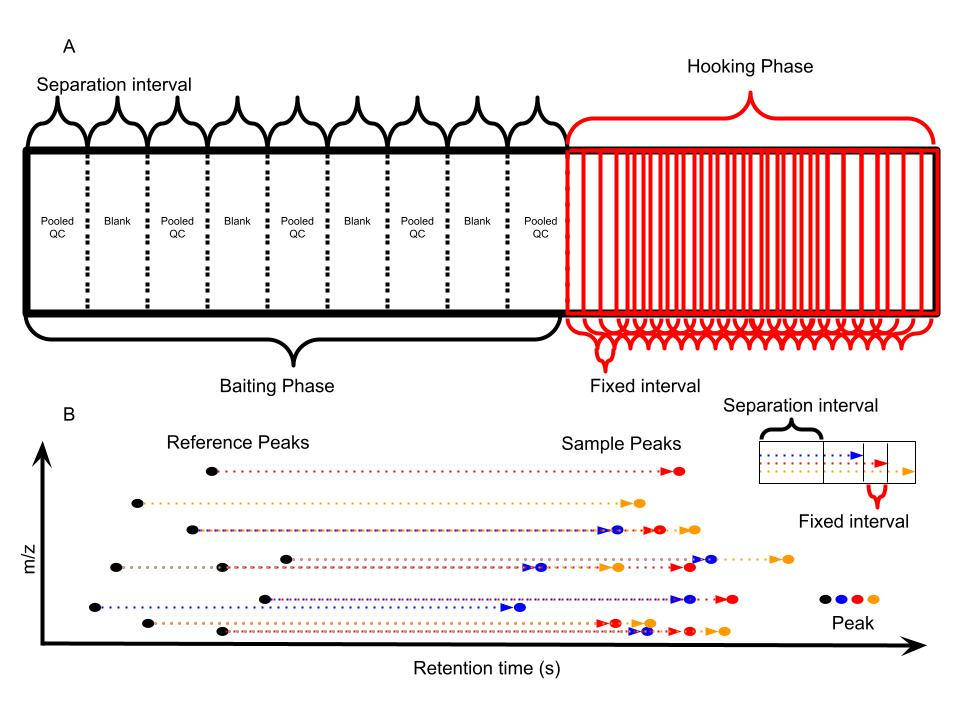

## Disclaimers

-   No conflict of interest

-   Open to question during presentation

-   Slides is available online

    -   <http://yufree.github.io/presentation/srda/umd.html>

## Metabolites discovery

-   Metabolites of endogenous compounds

    -   Activation/Inhibition of certain pathway

    -   Excretion from the biological system

-   Biotransformation of man-made compounds

    -   Drug
    -   Food additives
    -   Pesticides
    -   Flame retardant

-   Evaluation of their toxicity and risk

## Principle of metabolites discovery

-   Xenobiotics metabolism[^1]

[^1]: By TimVickers - Own work, Public Domain, <https://commons.wikimedia.org/w/index.php?curid=4549628>

## Problems

|                | **Aware**             | **Not aware**     |
|----------------|-----------------------|-------------------|
| Identified     | Known metabolites     | Unknown compounds |
| Not identified | Potential metabolites | Unknown unknowns  |

-   Standards for unknown compounds

-   Identification of potential metabolites

-   Unknown unknowns

## Current Solution

### *in silico* prediction of potential metabolites

-   Biotransformer 3.0[^2]

-   EAWAG-BBD Pathway Prediction System[^3]

[^2]: <https://doi.org/10.1093/nar/gkac313>

[^3]: <http://eawag-bbd.ethz.ch/index.html>

SMILES string or molecular structures as input

Limited by Number of Reaction Iterations (3)

## My solution

> Focused on relationship among compounds

{fig-align="center"}

From [Wikipedia Commons](https://commons.wikimedia.org/wiki/File:A_Sunday_on_La_Grande_Jatte,_Georges_Seurat,_1884.jpg):A Sunday on La Grande Jatte, Georges Seurat

## Why Reactions?

{fig-align="center"}

-   Unit: Gene (5) \< Protein (20+2) \< Metabolite (100K) \< Compound (100M)

-   Combination: Gene (20,000-25,000) \< Protein (20,000-25,000) \< Compound(???)

-   Small molecule **combination** is a chemical reaction or paired mass distance

## Why PMD?

-   [Nuclear Binding Energy](https://en.wikipedia.org/wiki/Nuclear_binding_energy)

$$\Delta m = Zm_{H} + Nm_{n} - M$$

-   The missing mass was converted into energy ( $E=mc^2$ ) and emitted when the atom was made

-   Atoms -\> Compounds -\> Mass distances between compounds

-   **Paired Mass Distances (PMD)** is unique

-   **High resolution** mass spectrometry is required

## PMDs in KEGG database

-   Top 10 high frequency PMDs cover 68% known reactions

{fig-align="center"}

::: footer
Communications Chemistry https://doi.org/10.1038/s42004-020-00403-z
:::

## PMDs in real data

::::: columns
::: {.column width="50%"}
-   Isotopologues

    -   $[M]^+$ $[M+1]^+$
    -   1.006 Da

-   in source reaction

    -   $[M+H]^+$ $[M+Na]^+$
    -   21.982 Da
:::

::: {.column width="50%"}
-   Homologous series

    -   Lipid $-[CH_2]-$
    -   14.016 Da

-   Xenobiotic metabolism

    -   Phase I hydrolation
    -   15.995 Da
:::
:::::

## PMD-based reactomics workflow

-   STEP1: Remove redundant peaks

-   STEP2: Extract high frequency PMDs

-   STEP3: Relationship network

## How many real compounds among features?

{fig-align="center"}

::: footer
Analytical Chemistry https://pubs.acs.org/doi/10.1021/acs.analchem.7b02380
:::

## Redundant peaks

-   Untargeted analysis would loss sensitivity to capture all peaks

-   Send unknown while independent peaks for MS/MS

{fig-align="center"}

## GlobalStd Algorithm

{fig-align="center"}

::: footer
Analytica Chimica Acta https://www.sciencedirect.com/science/article/pii/S0003267018313047
:::

## GlobalStd Algorithm Step 1

### Retention time cluster analysis

{fig-align="center"}

## GlobalStd Algorithm Step 2

### High frequency PMD analysis across RT clusters

{fig-align="center"}

## GlobalStd Algorithm Step 2

### High frequency PMD analysis across RT clusters - example

{fig-align="center"}

## GlobalStd Algorithm Step 3

### Independent peaks selection

{fig-align="center"}

## Extract high frequency PMDs

{fig-align="center"}

## How to define high frequency?

::::: columns
::: {.column width="50%"}

:::

::: {.column width="50%"}

:::
:::::

## Relationship network

{fig-align="center"}

## PMDDA workflow

{fig-align="center"}

::: footer
Journal of Cheminformatics https://jcheminf.biomedcentral.com/articles/10.1186/s13321-022-00586-8
:::

## PMDDA workflow

{fig-align="center"}

## Reactomics for metabolites discovery

-   Knowledge driven - custom PMDs lists

-   Data driven - high frequency PMDs list

-   Case study : Metabolites of TBBPA in Pumpkin

    -   Mass defect analysis to screen Brominated Compounds

    -   Confirmation by synthesized standards

## Case study

{fig-align="center"}

::: footer
Environmental Science & Technology https://pubs.acs.org/doi/10.1021/acs.est.9b02122
:::

## Shiny application

<https://yufree.shinyapps.io/pmdnet/>

## Case study

-   TBBPA Metabolites PMD network

{fig-align="center"}

::: footer
Communications Chemistry https://doi.org/10.1038/s42004-020-00403-z
:::

## Biomarker Reaction

-   Double bonds reactions in lung cancer

{fig-align="center"}

## Quantitative analysis of PMDs

-   Normalization the stable ions and use unstable ions for quantitative analysis

{fig-align="center"}

## Gatekeeper discovery

::: footer
ES&T https://pubs.acs.org/doi/abs/10.1021/acs.est.1c04039
:::

## Active molecular network

::: footer
E&H doi:10.1186/s13321-022-00586-8
:::

## Active molecular network

::: footer
E&H doi:10.1186/s13321-022-00586-8
:::

## Take-home message

-   Metabolites discovery can be data driven

-   Reaction is the "base pair" for small molecules

-   Real data always enriched in few PMDs or reactions

-   PMD network analysis can accelerate metabolites discovery

## One More Thing ...

**The Bottleneck:** Insufficient Throughput

-   **Throughput Gap:** Current output (thousands/year) lags behind genomics by an order of magnitude.
-   **Data Quality Issues:**
    -   Severe Batch Effects.
    -   Retention Time (RT) Shifts.

## Single File Injection (SFI)

## Future Applications

-   **Large-Scale Cohorts:** Ideal for biobanking and database construction.
-   **Dynamic Monitoring:** Combine with *in vivo* sampling for real-time biological processes.
-   **Clinical Potential:**
    -   Sample cost **\< \$10 USD**.
    -   High throughput targeted/non-targeted screening.

## Q&A

-   miao.yu\@jax.org

------------------------------------------------------------------------

## Validation: Experimental Setup

-   **Sample Set:** 158 human plasma samples.
-   **Dynamic Range:** Simulated across 7 orders of magnitude.
-   **Columns:** HILIC (Hydrophilic Interaction) & RP (Reverse Phase).
-   **Modes:** Positive (+) and Negative (-) Ion modes.

::: notes
**Time: 2:45 - 3:15** Describe the robust validation. You didn't just test it theoretically; you ran 158 plasma samples across both major column types and ionization modes.
:::

------------------------------------------------------------------------

## Validation: Key Results

**Speed:**

-   Total analysis time for 158 samples: **\< 6 hours**.

**Qualitative & Quantitative Success:**

-   **Peak Recovery:** \>2 million peaks matched to reference (per mode).

-   **Stability (RSD \< 30%):**

    -   **HILIC:** 506 (+) / 572 (-) reference peaks.
    -   **RP:** 450 (+) / 738 (-) reference peaks.

-   **Dynamic Range:** Preserved quantitative capabilities.

## Limitations

-   **Isomers:**
    -   Same $m/z$, different RT.
    -   *Mitigation:* Algorithm checks RT drift within 10s.
    -   *Impact:* \< 2% of aligned reference peaks affected.
-   **Separation Efficiency:**
    -   Isocratic elution is inherently less efficient than gradient elution.
-   **File size**
    -   1.5 GB per 100 samples.

## Endogenous vs Exogenous

-   T3DB Endogenous (255) vs Exogenous (705)

-   Use top 10 high frequency PMDs

{fig-align="center"}
