## 声明

- 无利益冲突

- 报告过程中欢迎随时打断提问

- 幻灯片可在线获取

  - <http://yufree.github.io/presentation/srda/umdcn.html>

## 非靶向分析的定性问题

|            | **理论存在** | **理论未知** |
|------------|--------------|--------------|
| 谱库匹配   | 已知化合物   | 未知化合物   |
| 谱库不匹配 | 潜在代谢物   | 未知的未知   |

- 已知化合物可用标准品定性且理论上也应该存在

- 未知化合物可以用标准品定性但说不清来源（非法添加）

- **潜在代谢物**理论上可推测但没有二级谱图

## 潜在代谢物发现

- 内源性化合物的代谢物

  - 特定代谢通路的激活/抑制
  - 从生物体系中存留/排出

- 外源化合物的生物转化

  - 药物
  - 食品添加剂
  - 农药

## 代谢物发现原理

- 外源代谢通路[^1]

[^1]: By TimVickers - Own work, Public Domain, <https://commons.wikimedia.org/w/index.php?curid=4549628>


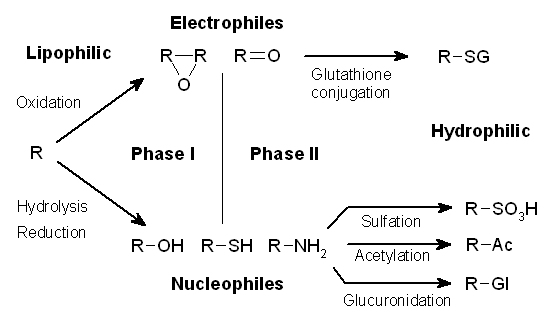

## 现有方案

### 潜在代谢物的计算机(*in silico*)预测

- 从结构出发预测代谢物

- Biotransformer 3.0[^2]

- EAWAG-BBD 代谢路径预测系统[^3]

[^2]: <https://doi.org/10.1093/nar/gkac313>

[^3]: <http://eawag-bbd.ethz.ch/index.html>

以 SMILES 字符串或分子结构为输入

受反应迭代次数限制(3 次)

## 转换思路

> 关注化合物之间的反应关系而非名字

{fig-align="center"}

来自 [Wikimedia Commons](https://commons.wikimedia.org/wiki/File:A_Sunday_on_La_Grande_Jatte,_Georges_Seurat,_1884.jpg):大碗岛的星期天下午,乔治·修拉

## 为什么用反应?

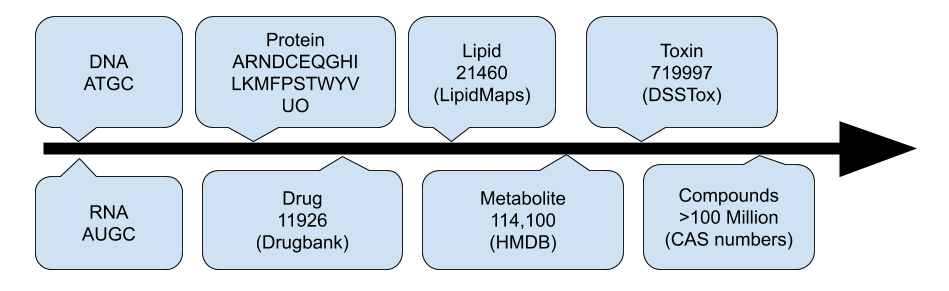{fig-align="center"}

- 单元:基因 (5) \< 蛋白质 (20+2) \< 代谢物 (10万) \< 化合物 (1亿)

- 组合:基因 (2万-2.5万) \< 蛋白质 (2万-2.5万) \< 化合物 (???)

- 小分子的**组合**就是化学反应或配对质量距离

## 为什么用 PMD?

- [核结合能](https://en.wikipedia.org/wiki/Nuclear_binding_energy)

$$\Delta m = Zm_{H} + Nm_{n} - M$$

- 原子形成时,缺失的质量转化为能量 ( $E=mc^2$ ) 并释放

- 原子 -\> 化合物 -\> 化合物之间的质量距离

- **配对质量距离 (Paired Mass Distance, PMD)** 是唯一的

- 需要**高分辨**质谱

## KEGG 数据库中的 PMD

- 频率最高的前 10 个 PMD （反应组）覆盖了 68% 的已知反应

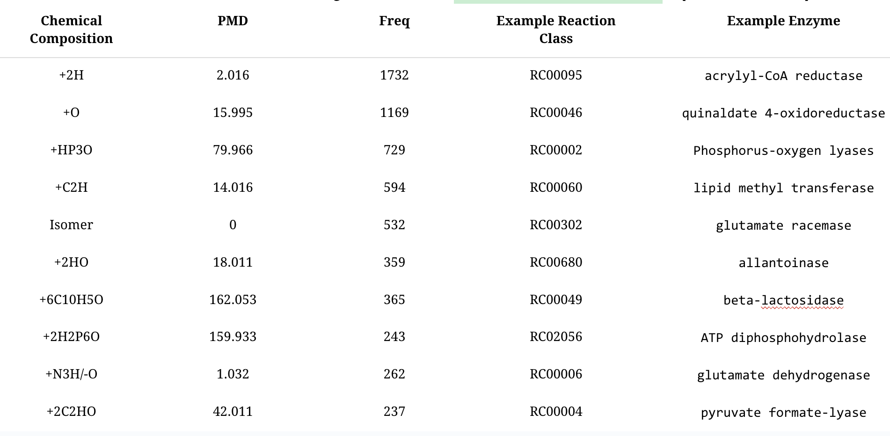{fig-align="center"}

::: footer
Communications Chemistry https://doi.org/10.1038/s42004-020-00403-z
:::

## 真实数据中的 PMD

::::: columns
::: {.column width="50%"}
- 同位素峰

  - $[M]^+$ $[M+1]^+$
  - 1.006 Da

- 源内反应

  - $[M+H]^+$ $[M+Na]^+$
  - 21.982 Da
:::

::: {.column width="50%"}
- 同系物系列

  - 脂质 $-[CH_2]-$
  - 14.016 Da

- 外源化合物代谢

  - I 相羟基化
  - 15.995 Da
:::
:::::

## 质谱峰中有多少真实化合物?

- 不到5%

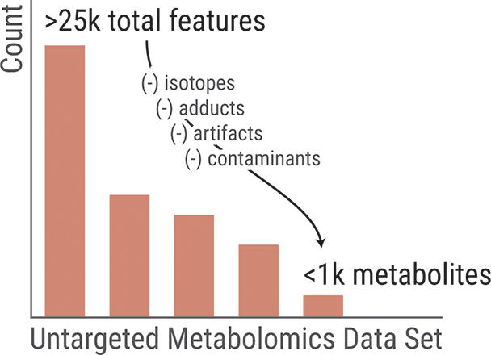{fig-align="center"}

::: footer
Analytical Chemistry https://pubs.acs.org/doi/10.1021/acs.analchem.7b02380
:::

## 冗余峰

- 非靶向分析若要捕获所有峰会损失灵敏度

- 仅将独立的未知峰送去 MS/MS

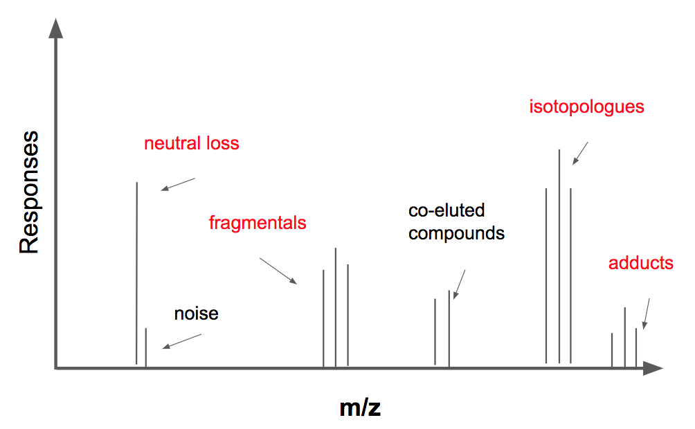{fig-align="center"}

## GlobalStd 算法

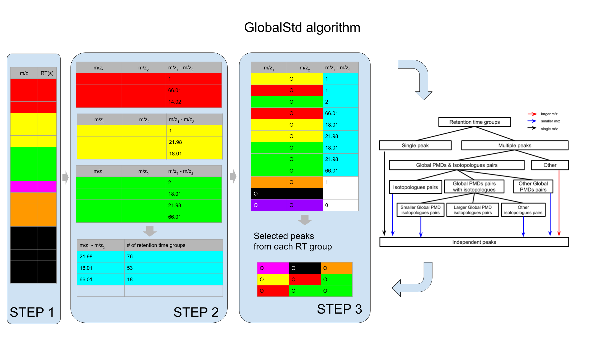{fig-align="center"}

::: footer
Analytica Chimica Acta https://www.sciencedirect.com/science/article/pii/S0003267018313047
:::

## GlobalStd 算法 第 1 步

### 保留时间聚类分析

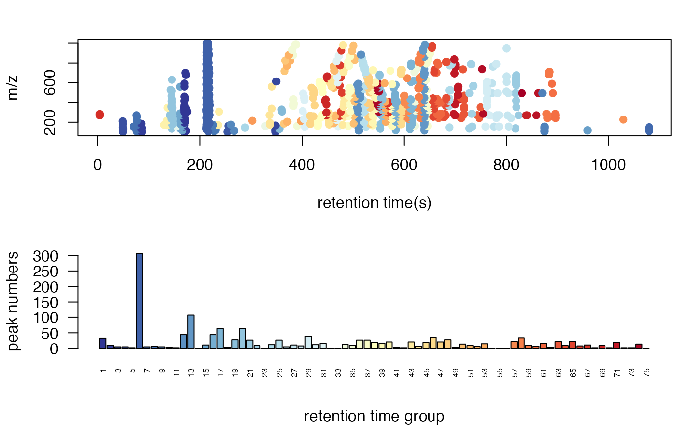{fig-align="center"}

## GlobalStd 算法 第 2 步

### 跨 RT 聚类的高频 PMD 分析

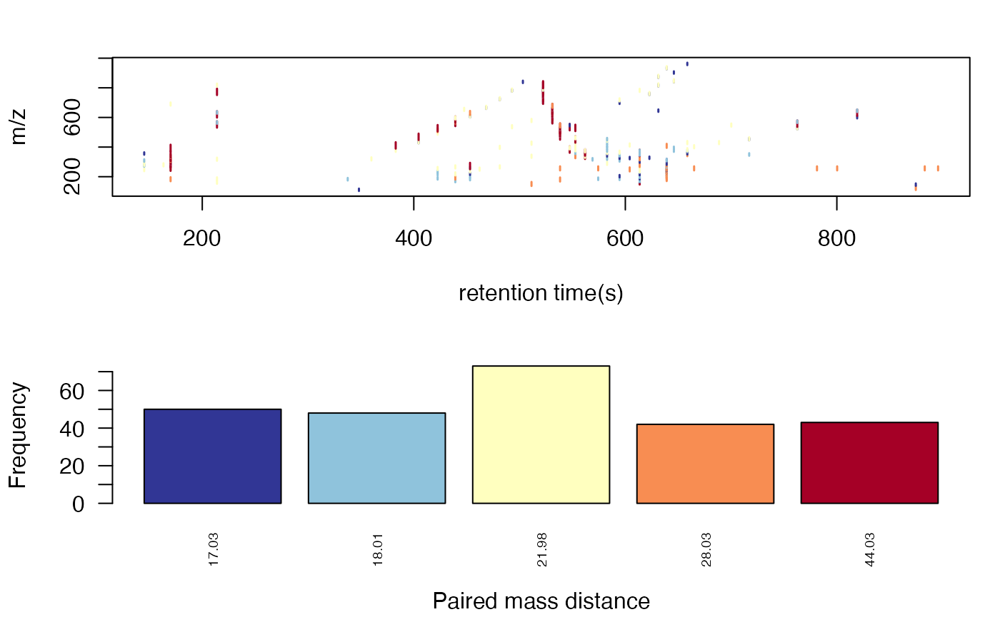{fig-align="center"}

## GlobalStd 算法 第 2 步

### 跨 RT 聚类的高频 PMD 分析 - 示例

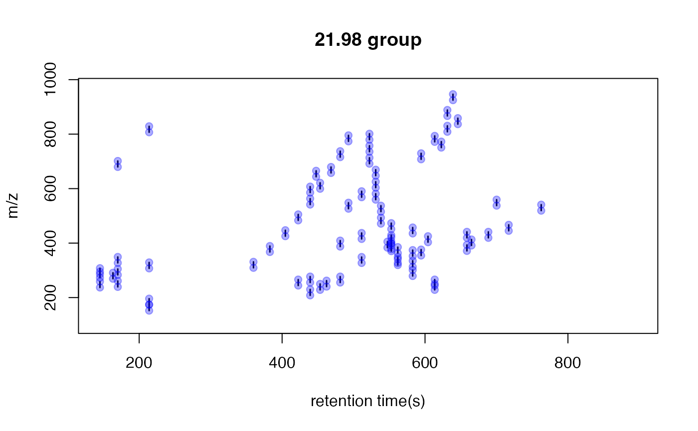{fig-align="center"}

## GlobalStd 算法 第 3 步

### 独立峰筛选

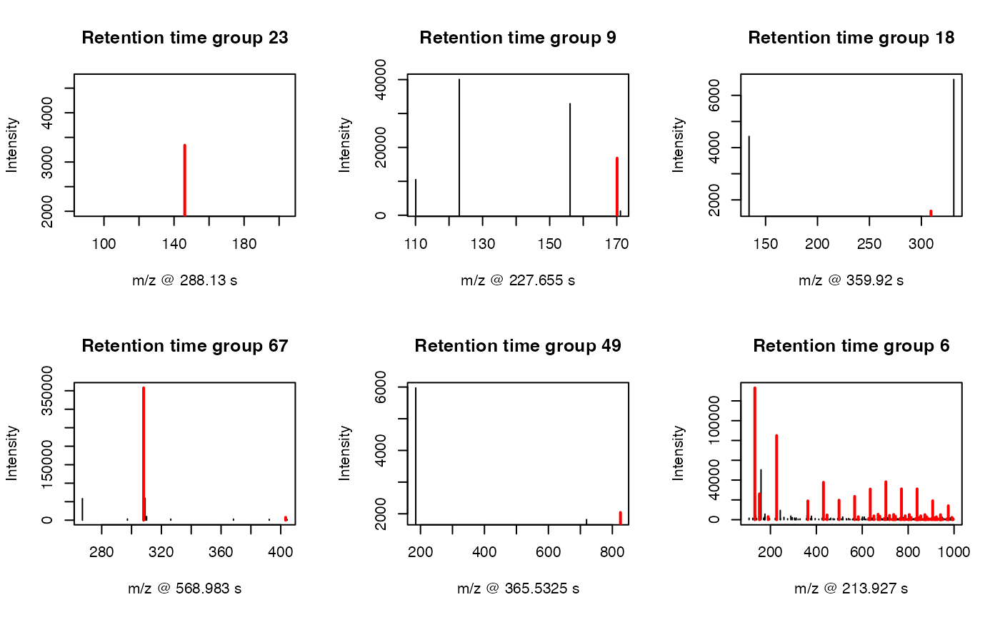{fig-align="center"}

## PMDDA 工作流程

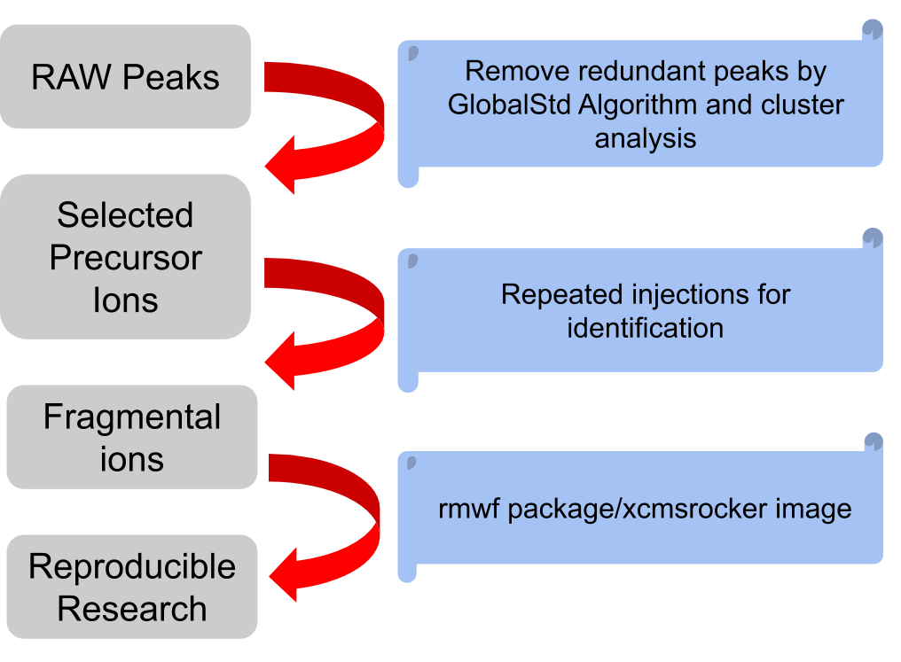{fig-align="center"}

::: footer
Journal of Cheminformatics https://jcheminf.biomedcentral.com/articles/10.1186/s13321-022-00586-8
:::

## PMDDA 工作流程

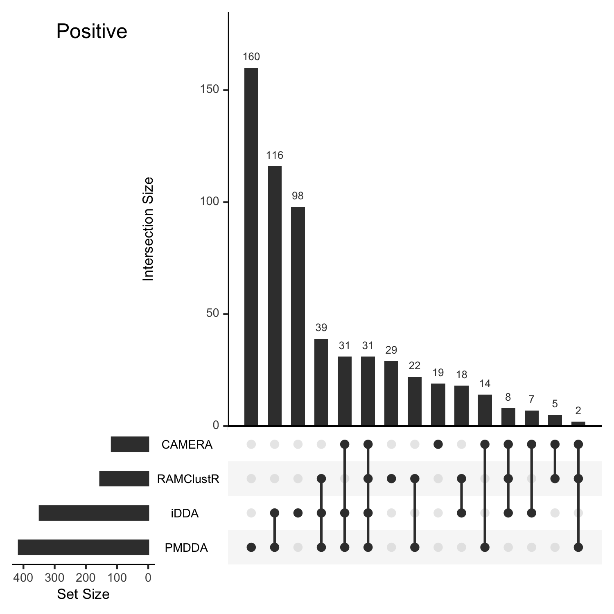{fig-align="center"}

## PMDDA 工作流程

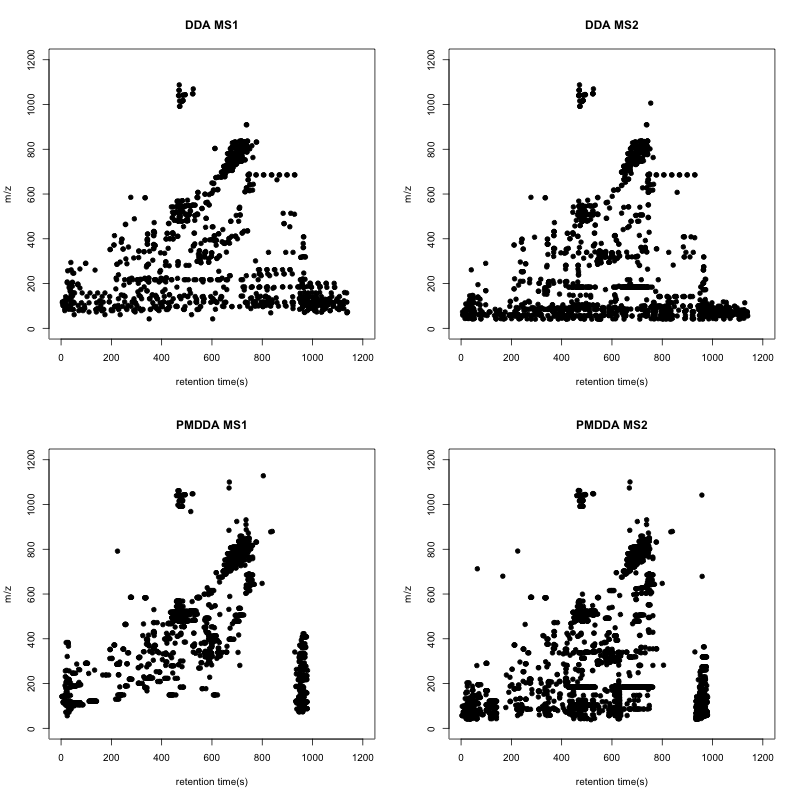{fig-align="center"}

## 代谢物发现

- 设定种子代谢物或污染物

- 自定义 PMD 列表作为反应集合递归式寻找污染物

- 案例:四溴双酚 A (TBBPA) 在南瓜中的代谢物

  - 质量亏损分析筛选溴代化合物

  - 合成标准品确证

## 案例研究

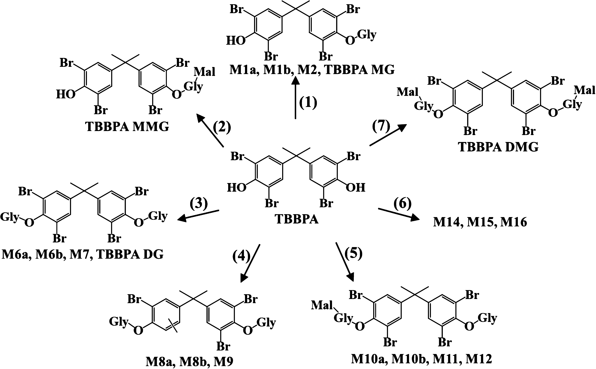{fig-align="center"}

::: footer
Environmental Science & Technology https://pubs.acs.org/doi/10.1021/acs.est.9b02122
:::

## 案例研究

- TBBPA 代谢物的 PMD 网络

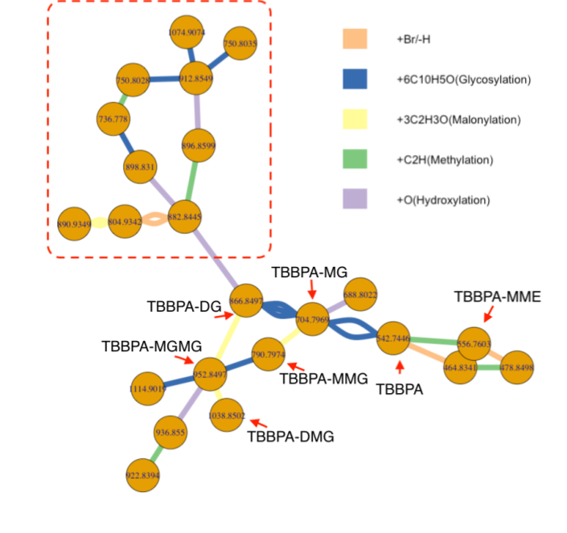{fig-align="center"}

::: footer
Communications Chemistry https://doi.org/10.1038/s42004-020-00403-z
:::

## 合作案例研究

- 全谷物小麦摄入后一次性鉴定并定量人尿液中 76 种小麦来源代谢物

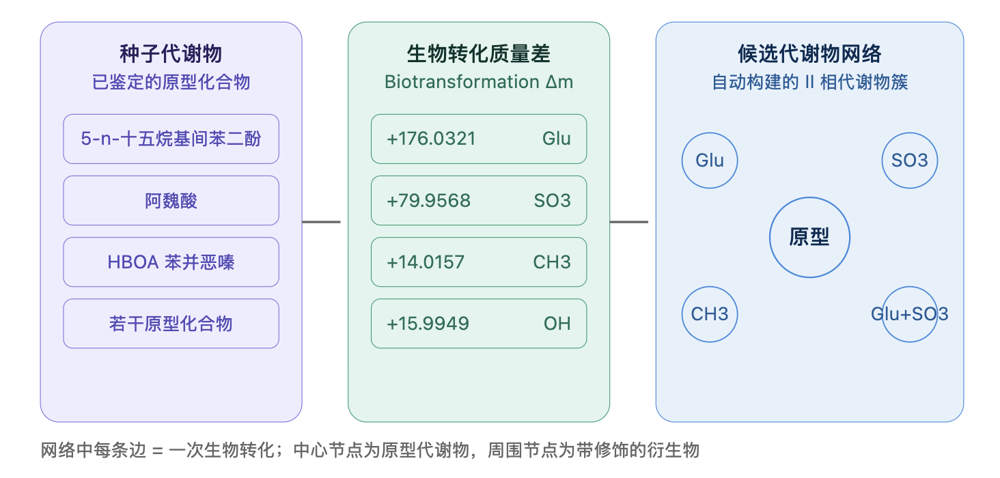{fig-align="center"}

::: footer
Molecular Nutrition & Food Research https://doi.org/10.1002/mnfr.202000615
:::

## PMD 语法

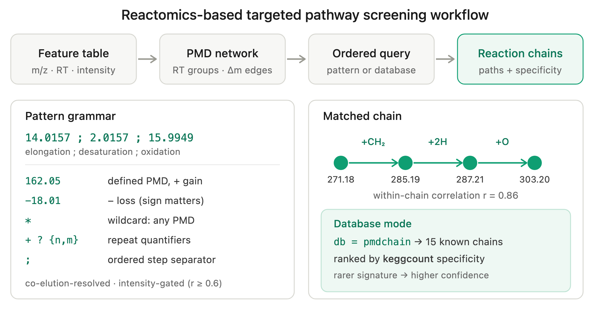{fig-align="center"}


## 小结

- 代谢物发现可以数据驱动

- 真实质谱数据总是富集于少数 PMD 或反应组

- 冗余峰贡献了峰表里的暗物质而非信息

- PMD 网络递归分析可加速代谢物发现

## 应用

- Shiny 应用 <https://yufree.shinyapps.io/pmdnet/>

- pmd 包 <https://cran.r-project.org/web/packages/pmd/index.html>


## One More Thing


- 顺序进样通量不足

  ```         
  - 单仪器年产出数千样品数据
  - 落后基因组学一个数量级
  ```

- 批次效应（batch effects）

- 保留时间漂移（retention time shifts）

## 现有应对策略

- 双柱切换系统

  ```         
  -  两根色谱柱交替使用
  ```

- 表面多孔填料色谱柱

  ```         
  - 高流速下仍有良好分离度
  ```

- 靶向质谱分析 MISER 或 SQUID 策略

  ```         
  - 固定时间间隔多重进样时间
  ```

## 单文件进样法

- 使用连续的等度洗脱进行色谱分离

  ```         
  -   每个样本的边际时间成本仅相当于固定的进样间隔时间
  ```

- 固定时间间隔的多重进样推广到非靶向分析

  ```         
  -   所有样本的数据将生成在一个单独的文件中
  ```

- 不进行仪器物理改造的情况下实现多样本的并行数据采集

- 提供数据分析支持软件

## 序列设计

### 参考峰采集

- 进行多个**混合样本**（Pooled Samples）和**空白样本**（Blank Samples）的完全分离

  ```         
  - 覆盖尽可能多的化合物

  - 排除掉背景干扰
  ```


## 序列设计

### 真实样本采集

- 在连续的等度洗脱条件下，以固定的时间间隔进不同样品

  ```         
    - 可插入混合样或空白样品进行质控
  ```


## 数据分析与峰恢复

- 开源 R 软件包 `sfi` （https://github.com/yufree/sfi）

### 核心算法


## 初步验证

### 实验样本

- 

  ```         
    158 个人血浆样本 
  ```

- 

  ```         
    模拟了横跨7个数量级的宽动态范围
  ```

- 

  ```         
    HILIC（亲水作用色谱）和 RP（反相色谱）柱
  ```

- 

  ```         
    正离子和负离子双模式
  ```

## 初步验证

### 定性定量结果

- 

  ```         
    包括质量控制样本在内，158 个样本的总分析时间 < 6 小时
  ```

- 

  ```         
    HILIC 正/负模式下，从 158 个样本中分别恢复了 2,852,581 / 2,613,583 个与参考峰匹配的峰

    - 在 HILIC 柱上，506/572 个参考峰（正/负模式）的相对标准偏差（RSD）低于 30%
  ```

- 

  ```         
    RP 正/负模式下，分别匹配了 2,545,314 / 2,141,019 个峰

    - 在 RP 柱上，450/738 个参考峰（正/负模式）的 RSD 低于 30%
  ```

## 初步验证

### 定量动态范围


## Q&A

- yumiao\@rcees.ac.cn
