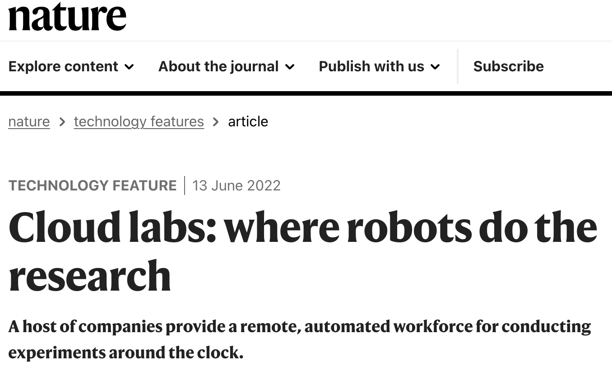

```{r setup, include=FALSE}
options(htmltools.dir.version = FALSE)
knitr::opts_chunk$set(fig.align='center',echo = F, cache=T,message=FALSE,warning=FALSE,comment=NA)
```

## 报告目录

### 科学研究的趋势

### 科研数据分析的需求

### 科研开源数据分析平台

### 展示与小结

---

## 科学研究的趋势

### 高成本

### 云实验室

### 开放数据

---

## 科学研究的趋势 - 高成本

```{r echo=FALSE,out.width = "600px"}

```

---

## 科学研究的趋势 - 高成本

```{r echo=FALSE,out.width = "350px", fig.cap="中国统计年鉴（2021）"}

```

---

## 科学研究的趋势 - 云实验室

```{r echo=FALSE,out.width = "800px"}

```

---

## 科学研究的趋势 - 开放数据

```{r echo=FALSE,fig.cap="Growth in Figshare, Dryad, Dataverse, Mendeley Data, Open Science Framework and Vivli DOIs in the published literature (2011-2021) (From Dimensions.ai)",out.width = "800px"}

```

---

## 科学研究的趋势 - 可重复性

```{r}
library(scifigure)
exps <- init_experiments(2)
exps[c("analyst","estimate","claim"), 2] <- "different"
exps[c("code"), 2] <- "unobserved"
exps[c("claim"), 2] <- "incorrect"
hide_stages = NULL
sci_figure(exps)
```

---

## 科研数据分析的需求

### 科学问题导向 -- 不关心软件工程

### 统计功能全 -- 应对审稿人补充分析

### 可复用 -- 技能有传承

### 开放 -- 开源且最好免费

### 出图漂亮 -- 自定义要求高

---

## 科研开源数据分析平台 - 容器化技术

```{r echo=FALSE,out.width = "800px"}
knitr::include_graphics('images/virtualization-vs-containers_transparent.png')
```

<https://www.redhat.com/en/topics/containers/containers-vs-vms>

---

## 科研开源数据分析平台 - xcmsrocker

- 安装了 RStudio 的容器 （[rocker](https://rocker-project.org/) 项目）

- 预装了常见代谢组学软件

- 可通过API下载分析开源数据（MetaboLights/Metabolomics Workbench）

- 提供了工作流模版

- 可跨平台运行、可适配云计算平台或高性能计算集群

---

## 科研开源数据分析平台 xcmsrocker - 预装软件（部分）

.pull-left[

特征峰提取

- xcms
- x13cms

峰提取优化

- IPO
- Autotuner

峰标注

- CAMERA
- RAMClustR
- xMSannotator
- ClassyfireR
]

.pull-right[

峰鉴定

- MetaboAnnotation
- MegFragr

多组学

- MetabNet
- xMWAS

化学信息学

- webchem
- ChemmineR

统计分析

- caret
- h2o

]

---

## 科研开源数据分析平台 xcmsrocker - 内置模版

```{r echo=FALSE,out.width = "500px"}

```

---

## 科研开源数据分析平台 xcmsrocker - 安装

```{r echo=FALSE,out.width = "800px"}
knitr::include_graphics('https://raw.githubusercontent.com/yufree/yufree.cn/master/static/images/pmdda.gif')
```

---

## 科研开源数据分析平台 xcmsrocker - [Shiny](https://shiny-xcms-uds7muwila-uc.a.run.app/pmd/)

```{r echo=FALSE,out.width = "800px"}

```

- [配置方法](https://github.com/yufree/xcmsrocker/tree/master/shiny_xcms)

---

## 科研开源数据分析平台 xcmsrocker - 平台化展望

```{r echo=FALSE,out.width = "800px"}

```

---

## 小结

### 科研可重复性的未来在于数据分析

### 科研数据分析需要模块化流程化

### 发表文章的同时请分享数据与数据处理脚本

---

class: center, middle

## 谢谢！

## yufree@live.cn
